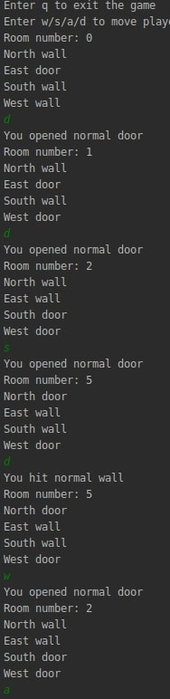

# Laboratorium 3
## Wzorce projektowe
## Autorzy Andrii Trishch, Uladzislau Tumilovich

#### 1. Builder:
Zdefiniuj nową wersję funkcji składowej createMaze, która będzie przyjmować jako argument
obiekt budujący klasy MazeBuilder.

**a)** Został stworzony interface **MazeBuilder**, który zawiera wyznacza metody tworzenia poszczególnych element Labiryntu.
```java
public interface MazeBuilder {
    void addRoom(Room room);
    void addDoor(Room r1,Room r2)throws Exception;
    void addCommonWall(Direction roomDirection,Room r1,Room r2)throws Exception;
}
```

**b)** Została zmodyfikowaną funkcja składową tak, aby przyjmowała jako parametr obiekt klasy **MazeBuilder**.

```java
public class MazeGame {
    public Maze createMaze(MazeBuilder builder) throws Exception {
        Room r1 = new Room(1), r2 = new Room(2);
        builder.addRoom(r1);
        builder.addRoom(r2);
        builder.addCommonWall(North,r1,r2);
        builder.addDoor(r1, r2);
        return builder.getCurrentMaze();
    }
}
```
**c)** Zostali wyeliminowani szczegóły tworzenia obiektów. Dana funkcjonalność została przeniesiona na klasy implementujące **MazeBuilder**.

**d)**  Stworzona klasa **StandardMazeBuilder** implementująca interface **MazeBuilder**, dodany atrybut prywatny **currentMaze**.
```java
public class StandardMazeBuilder implements MazeBuilder {
    private Maze currentMaze;

    public StandardMazeBuilder() {
        this.currentMaze = new Maze();
    }

    @Override
    public void addRoom(Room room) {
        room.setSide(South, new Wall());
        room.setSide(North, new Wall());
        room.setSide(East, new Wall());
        room.setSide(West, new Wall());
        currentMaze.addRoom(room);
    }

    @Override
    public void addDoor(Room r1, Room r2) throws Exception {
        Direction r1Door = null;
        for (Direction dir : Direction.values()) {
            if (r1.getSide(dir).equals(r2.getSide(dir.getOppositeSide()))) {
                r1Door = dir;
                break;
            }
        }
        if (r1Door == null) throw new Exception("Seems like rooms don't have common door");
        else {
            Door newDoor = new Door(r1, r2);
            r1.setSide(r1Door, newDoor);
            r2.setSide(r1Door.getOppositeSide(), newDoor);
        }
    }

    @Override
    public void addCommonWall(Direction r1Direction, Room r1, Room r2) throws Exception {
        MapSite side = r1.getSide(r1Direction);
        if (side == null) throw new Exception("Seems like such a room doesn't exist");
        r2.setSide(r1Direction.getOppositeSide(), side);
    }

    public Maze getCurrentMaze() {
        return this.currentMaze;
    }
}
```

**e)** Został utworzony labirynt przy pomocy operacji **createMaze()**, gdzie parametrem jest obiekt
klasy **StandardMazeBuilder**.
```java
public class Main {
    public static void main(String[] args) throws Exception {
        MazeGame mazeGame = new MazeGame();
        MazeBuilder builder=new StandardMazeBuilder();
        Maze maze = mazeGame.createMaze((StandardMazeBuilder) builder);
        System.out.println(maze.getRoomNumbers());
    }
}
```
**f)** Stwórzona kolejną podklasę **MazeBuilder** o nazwie **CountingMazeBuilder**, która zlicza utworzone komponenty różnych rodzajów.
```java
public class CountingMazeBuilder implements MazeBuilder {
    private int elementsNumber = 0;

    @Override
    public void addRoom(Room room) {
        elementsNumber += 5;

    }

    @Override
    public void addDoor(Room r1, Room r2) throws Exception {
        elementsNumber++;
    }

    @Override
    public void addCommonWall(Direction roomDirection, Room r1, Room r2) throws Exception {
        elementsNumber--;
    }

    int GetCounts() {
        return elementsNumber;
    }
}
```

#### 2.Fabryka abstrakcyjna:
**a)** Stwórzona klasa **MazeFactory**, która służy do tworzenia elementów labiryntu.
```java 
public class MazeFactory {
    public Door createDoor(Room r1, Room r2) {
        return new Door(r1, r2);
    }

    public Room createRoom(int number) {
        return new Room(number);
    }

    public Wall createWall() {
        return new Wall();
    }
}
```

**b)** Modyfikacja funkcji **createMaze()** tak, aby jako parametr przyjmowała MazeFactory.
```java
public Maze createMaze(StandardMazeBuilder builder, MazeFactory factory) throws Exception {
    Room r1 = new Room(1), r2 = new Room(2);
    builder.addRoom(r1);
    builder.addRoom(r2);
    builder.addCommonWall(North, r1, r2);
    builder.addDoor(r1, r2);
    return builder.getCurrentMaze();
}
```

**c)** Została stwórzona klasa **EnchantedMazeFactory**, która dziedziczy z **MazeFactory** i tworży Enchanted-Room/Wall/Door

Klasa EnchantedRoom:
```java 
public class EnchantedRoom extends Room {
    public EnchantedRoom(int number) {
        super(number);
    }

    @Override
    public void Enter() {
        System.out.println("Entered enchanted room");
    }
}
```
Klasa EnchantedWall:
```java
public class EnchantedWall extends Wall {
    public EnchantedWall(){
        super();
    }


    @Override

    public void Enter() {
        System.out.println("Entered enchanted room");
    }
}
```
Klasa EnchantedDoor:
```java
public class EnchantedDoor extends Door {

    public EnchantedDoor(Room r1, Room r2) {
        super(r1, r2);
    }

    @Override
    public void Enter() {
        System.out.println("Entered enchanted door");
    }
} 
```
Klasa EnchantedMazeFactory:
```java
public class EnchantedMazeFactory extends MazeFactory {
    public EnchantedMazeFactory(){
        super();    
    }
    
    @Override
    public Door createDoor(Room r1, Room r2) {
        return new EnchantedDoor(r1, r2);
    }

    @Override
    public Room createRoom(int number) {
        return new EnchantedRoom(number);
    }

    @Override
    public Wall createWall() {
        return new EnchantedWall();
    }
}
```
Została stwórzona klasa **BombedMazeFactory**, która dziedziczy z **MazeFactory** i tworży Bombed-Room/Wall

KlasaBombedRoom:
```java 
public class BombedRoom extends Room {
    public BombedRoom(int number) {
        super(number);
    }

    @Override
    public void Enter() {
        System.out.println("Entered bombed room");
    }
}
```
Klasa BombedWall:
```java
public class BombedWall extends Wall{
    public BombedWall(){
        super();
    }
    @Override
    public void Enter() {
        System.out.println("Entered bombed wall");
    }
}
```
Klasa BombedMazeFactory:
```java
public class BombedMazeFactory extends MazeFactory {
    public BombedMazeFactory(){
        super();
    }   
    @Override
    public Room createRoom(int number) {
        return new BombedRoom(number);
    }

    @Override
    public Wall createWall() {
        return new BombedWall();
    }
}
```

#### 3.Singleton
Wprowadź w powyżej stworzonej implementacji mechanizm, w którym MazeFactory będzie
Singletonem. Powinien być on dostępny z pozycji kodu, który jest odpowiedzialny z tworzenie
poszczególnych części labiryntu.

**a)** Zostali zmodyfikowani wszystkie 'fabryki', żeby tworzyć instanję klasy dawało się tyłko jeden raz.

Klasa MazeFactory:
```java
public class MazeFactory {
    private static MazeFactory instance;

    public static MazeFactory getInstance(){
        if( instance == null){
            instance = new MazeFactory();
        }
        return instance;
    }
    public Door createDoor(Room r1, Room r2) {
        return new Door(r1, r2);
    }

    public Room createRoom(int number) {
        return new Room(number);
    }

    public Wall createWall() {
        return new Wall();
    }
}

```
Klasa EnchantedMazeFactory:
```java
public class EnchantedMazeFactory extends MazeFactory {
    private static EnchantedMazeFactory instance;

    public static EnchantedMazeFactory getInstance(){
        if( instance == null){
            instance = new EnchantedMazeFactory();
        }
        return instance;
    }
    @Override
    public Door createDoor(Room r1, Room r2) {
        return new EnchantedDoor(r1, r2);
    }

    @Override
    public Room createRoom(int number) {
        return new EnchantedRoom(number);
    }

    @Override
    public Wall createWall() {
        return new EnchantedWall();
    }
}
```
Klasa BombedMazeFactory:
```java
public class BombedMazeFactory extends MazeFactory {
    private static BombedMazeFactory instance;

    public static BombedMazeFactory getInstance(){
        if( instance == null){
            instance = new BombedMazeFactory();
        }
        return instance;
    }
    @Override
    public Room createRoom(int number) {
        return new BombedRoom(number);
    }

    @Override
    public Wall createWall() {
        return new BombedWall();
    }
}
```
**b)** Do **StandardMazeBuilder** dodano atrybut **factory** i zostali zmodyfikowani metody *createDoorBetweenRooms()* i *addRoom()*,
którzy tworzą elementy przy pomocy fabryki.
```java
public class StandardMazeBuilder implements MazeBuilder {
    private Maze currentMaze;
    private MazeFactory factory;

    public StandardMazeBuilder(MazeFactory factory) {
        this.currentMaze = new Maze();
        this.factory=factory;
    }

    @Override
    public void addRoom(Room room) {
        room.setSide(South, factory.createWall());
        room.setSide(North, factory.createWall());
        room.setSide(East, factory.createWall());
        room.setSide(West, factory.createWall());
        currentMaze.addRoom(room);
    }

    @Override
    public void addDoor(Room r1, Room r2) throws Exception {
        Direction r1Door = null;
        for (Direction dir : Direction.values()) {
            if (r1.getSide(dir).equals(r2.getSide(dir.getOppositeSide()))) {
                r1Door = dir;
                break;
            }
        }
        if (r1Door == null) throw new Exception("Seems like rooms don't have common door");
        else {
            Door newDoor = factory.createDoor(r1, r2);
            r1.setSide(r1Door, newDoor);
            r2.setSide(r1Door.getOppositeSide(), newDoor);
        }
    }

    @Override
    public void addCommonWall(Direction r1Direction, Room r1, Room r2) throws Exception {
        MapSite side = r1.getSide(r1Direction);
        if (side == null) throw new Exception("Seems like such a room doesn't exist");
        r2.setSide(r1Direction.getOppositeSide(), side);
    }

    public Maze getCurrentMaze() {
        return this.currentMaze;
    }
}
```
#### 4.Rozszerzenie aplikacji labirynt
**a)** Korzystając z powyższych implementacji dodaj prosty mechanizm przemieszczania się po labiryncie.  Po realizacji wcześniejszych zadań pozostaje stworzyć prostą klasę Player,która za pomocą np. strzałek + tekstu w konsoli będzie mogła zadecydować o kierunkuchodzenia. Rozpatrz stosowne warianty rozgrywki (czy ściana ma drzwi przez które możemyprzejść itp. itd.). Wprowadź elementy BombedRoom/BombedWall (rozwiązanie co się wtedystanie zostawiam twórcy. Może być timer, który po 15s bez decyzji zabija gracza etc.).

**a)** Zostala stworzona klasa Player z jednym polem _Room currentRoom_. Pole pokazuję pokój w którym znajduję się gracz. Dodatkowo zostały stworzone metody _move_ (Umożliwie ruch gracza po labiryncie), _status_ (Wypisuję info o pokoju w którym znajduję się gracz) i getter i setter prywatnego pola _currentRoom_ 

Klasa Player:
```java
public class Player {

    private Room currentRoom;

    public Player(Room currentRoom) {
        this.currentRoom = currentRoom;
    }

    public void move(Direction dir) {
        MapSite side = this.currentRoom.getSide(dir);
        side.Enter();
        if (side instanceof Door) {
            this.currentRoom = ((Door) side).getRoomAtOthersSide(currentRoom);
        }
    }

    public void status() {
        System.out.println("Room number: " + this.currentRoom.getRoomNumber());
        for (Direction dir : Direction.values()) {
            if (this.currentRoom.getSide(dir) instanceof Door) {
                System.out.println(dir + " door");
            } if (this.currentRoom.getSide(dir) instanceof Wall) {
                System.out.println(dir + " wall");
            } if (this.currentRoom.getSide(dir) instanceof Room) {
                System.out.println(dir + " Room");
            }
        }
    }

    public void setCurrentRoom(Room currentRoom) {
        this.currentRoom = currentRoom;
    }

    public Room getCurrentRoom() {
        return this.currentRoom;
    }
}
```

**b)** Została stworzona i dodana do klasy Door dodatkowa metoda _getRoomAtOtherSide(Room firstR)_ która wraca pokój z drugiej strony drzwiej

Klasa Door:
```java
public Room getRoomAtOthersSide(Room firstR) {
        return room1 == firstR ? room2 : room1;
    }
```

**c)** Klasa MazeGame została modyfikowana przez dodawanie nowych metod które tworzą cykl gry

Klasa MazeGame:
```java
public class MazeGame {

    private Player player;

    private static MazeGame instance;

    public static MazeGame getInstance() {
        if (instance == null) {
            instance = new MazeGame();
        }
        return instance;
    }

    public void start() {
        System.out.println("Enter q to exit the game");
        System.out.println("Enter w/s/a/d to move player");
        loop();
    }

    private void loop() {
        Scanner scan = new Scanner(System.in);
        while (true) {
            player.status();
            char c = scan.next().charAt(0);
            switch (c) {
                case 'w':
                    this.player.move(North);
                    break;
                case 's':
                    this.player.move(South);
                    break;
                case 'a':
                    this.player.move(West);
                    break;
                case 'd':
                    this.player.move(East);
                    break;
                case 'q':
                    stop();
                    return;
                default:
                    System.out.println("Unknown command: " + c);
                    break;
            }
        }
    }

    public void stop() {
        System.out.println("Exiting game...");
    }

    public void createMaze(StandardMazeBuilder builder, MazeFactory factory) throws Exception {
        this.player = new Player(buildExampleMaze(builder, factory));
        Maze maze = builder.getCurrentMaze();
    }

    private Room buildExampleMaze(StandardMazeBuilder builder, MazeFactory factory) throws Exception {
        Room[] rooms = new Room[9];
        for (int i = 0; i < 9; i++) {
            rooms[i] = factory.createRoom(i);
            builder.addRoom(rooms[i]);
        }

        builder.addCommonWall(Direction.East, rooms[0], rooms[1]);
        builder.addCommonWall(Direction.South, rooms[0], rooms[3]);
        builder.addCommonWall(Direction.East, rooms[1], rooms[2]);
        builder.addCommonWall(Direction.South, rooms[1], rooms[4]);
        builder.addCommonWall(Direction.South, rooms[2], rooms[5]);
        builder.addCommonWall(Direction.East, rooms[3], rooms[4]);
        builder.addCommonWall(Direction.South, rooms[3], rooms[6]);
        builder.addCommonWall(Direction.East, rooms[4], rooms[5]);
        builder.addCommonWall(Direction.South, rooms[4], rooms[7]);
        builder.addCommonWall(Direction.South, rooms[5], rooms[8]);
        builder.addCommonWall(Direction.East, rooms[6], rooms[7]);
        builder.addCommonWall(Direction.East, rooms[7], rooms[8]);

        builder.addDoor(rooms[0], rooms[1]);
        builder.addDoor(rooms[1], rooms[2]);
        builder.addDoor(rooms[2], rooms[5]);
        builder.addDoor(rooms[4], rooms[5]);
        builder.addDoor(rooms[4], rooms[7]);
        builder.addDoor(rooms[7], rooms[8]);
        builder.addDoor(rooms[6], rooms[7]);
        builder.addDoor(rooms[3], rooms[6]);

        return rooms[0];
    }
}
```


**d)** I na koniec zostałą zmodyfikowana klasa Main w taki sposób, żeby wszystko uruchomiło się

Klasa Main:
```java
public class Main {
    public static void main(String[] args) throws Exception {
        MazeGame mazeGame = new MazeGame();
        MazeFactory mazeFactory = MazeFactory.getInstance();
        StandardMazeBuilder builder = new StandardMazeBuilder(mazeFactory);
        mazeGame.createMaze(builder, mazeFactory);
        mazeGame.start();
    }
}
```

**e)** Wynik działania programu



**a)** Zademonstruj, że MazeFactory faktycznie jest Singletonem (najłatwiej stworzyć przykład,w którym się sprawdza, czy obiekt zwracany przy 2 konstrukcji to faktycznie ten sam, któryzostał stworzony na początku).

Została stworzona klasa MazeFactoryTest która testuję działanie metody _getInstance_

Klasa Main:
```java
class MazeFactoryTest {

    @Test
    void getInstance() {
        MazeFactory factory = MazeFactory.getInstance();

        assertEquals(factory, MazeFactory.getInstance());
        assertEquals(factory, MazeFactory.getInstance());

        MazeFactory factory2 = MazeFactory.getInstance();

        assertEquals(factory2, MazeFactory.getInstance());
        assertEquals(factory2, MazeFactory.getInstance());

        assertEquals(factory, factory2);
    }
}
```
Poniżej został przedstawiony wynik testów:


