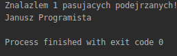
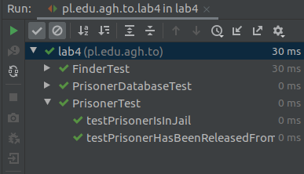

# Laboratorium 4
## Refaktoryzacja
## Autorzy Andrii Trishch, Uladzislau Tumilovich

#### Krok 1. Diagram UML:

##### Diagram podany na cwiczeniu


##### Nasz diagram:


W odróżnieniu od diagramu podanego na ćwiczeniu nasz diagram wyświetla zależność między klasami **Finder** i **PrisonerDataProvider**/**PersonDatabase**, a nie asocjacje, bo podane wyżej klasy nie zawierają obiektów klasy **Finder**.

#### Krok 2. Poprawa podstawowych blędów:

**a)** Została zmieniona klasa Prisoners. Do atrybutów **firstname**, **lastname** został zmieniony dostęp z *publicznego* na *przywatny*, z czego wynika potrzeba stworzenia _geterów_, nazwa metody **display()** na **toString()**, **firstname()** na **getFirstName()**, **middleName** na **getLastName**, czy **MoglbyEwentualnieBycPodejrzany()** na **canBesuspected()**, bo jest ważne pisanie nazw wszystkich metod w jedny jężyku. 

```java
public class Prisoner {
    private final String firstName;

    private final String lastName;

    private final int judgementYear;

    private final int sentenceDuration;

    private final String pesel;

    public String getFirstName() {
        return firstName;
    }

    public String getLastName() {
        return lastName;
    }

    public Prisoner(String firstName, String lastName, String pesel, int judgementYear, int sentenceDuration) {
        this.firstName = firstName;
        this.lastName = lastName;
        this.pesel = pesel;
        this.judgementYear = judgementYear;
        this.sentenceDuration = sentenceDuration;
    }

    public String getPesel() {
        return pesel;
    }

    public boolean canBeSuspected() {
        return judgementYear + sentenceDuration >= getCurrentYear();
    }

    public int getCurrentYear() {
        return Calendar.getInstance().get(Calendar.YEAR);
    }

    public String toString() {
        return firstName+ " " + lastName;
    }
}
```

**b)** Zostala zmieniona klasa Prisoners Database. Zmieniono nazwe metody **render()** na **toString()**, **findAll()** na **getPrisoners()**, **getAllPrisons()** na **getPrisons()**.

```java
public class PrisonersDatabase {

    private final Map<String, Collection<Prisoner>> prisoners = new HashMap<String, Collection<Prisoner>>();

    public PrisonersDatabase() {
        addPrisoner("Wiezienie krakowskie", new Prisoner("Jan", "Kowalski", "87080452357", 2005, 7));
        addPrisoner("Wiezienie krakowskie", new Prisoner("Anita", "Wiercipieta", "84080452357", 2009, 3));
        addPrisoner("Wiezienie krakowskie", new Prisoner("Janusz", "Zlowieszczy", "92080445657", 2001, 10));
        addPrisoner("Wiezienie przedmiejskie", new Prisoner("Janusz", "Zamkniety", "802104543357", 2010, 5));
        addPrisoner("Wiezienie przedmiejskie", new Prisoner("Adam", "Future", "880216043357", 2020, 5));
        addPrisoner("Wiezienie przedmiejskie", new Prisoner("Zbigniew", "Nienajedzony", "90051452335", 2011, 1));
        addPrisoner("Wiezienie centralne", new Prisoner("Jan", "Przedziwny", "91103145223", 2009, 4));
        addPrisoner("Wiezienie centralne", new Prisoner("Janusz", "Podejrzany", "85121212456", 2012, 1));
    }

    public Map<String, Collection<Prisoner>> getPrisoners() {
        return prisoners;
    }

    public Collection<String> getPrisons() {
        return prisoners.keySet();
    }

    private void addPrisoner(String category, Prisoner prisoner) {
        if (!prisoners.containsKey(category))
            prisoners.put(category, new ArrayList<Prisoner>());
        prisoners.get(category).add(prisoner);
    }
}
```

**c)** Zostala zmieniona nazwa klasy **PersonDataProvider** na **PersonDatabase**. Nazwa List **cracovCitizens**na **cracovPersons**, nazwa metody **getAllCracovCitizens** na **getCracovPersons**, została stworzona metoda **addCracovPerson(firstName,lastName,age)**, żeby zmniejszyć powtórzenie kodu. 

```java
public class PersonDatabase {

    private final Collection<Person> cracovPersons = new ArrayList<Person>();

    public PersonDatabase() {
        addCracovPerson("Jan", "Kowalski", 30);
        addCracovPerson("Janusz", "Krakowski", 30);
        addCracovPerson("Janusz", "Mlodociany", 10);
        addCracovPerson("Kasia", "Kosinska", 19);
        addCracovPerson("Piotr", "Zgredek", 29);
        addCracovPerson("Tomek", "Gimbus", 14);
        addCracovPerson("Janusz", "Gimbus", 15);
        addCracovPerson("Alicja", "Zaczarowana", 22);
        addCracovPerson("Janusz", "Programista", 77);
        addCracovPerson("Pawel", "Pawlowicz", 32);
        addCracovPerson("Krzysztof", "Mendel", 30);
    }

    public Collection<Person> getCracovPersons() {
        return cracovPersons;
    }
    private void addCracovPerson(String firstName,String lastName,int age){
        this.cracovPersons.add(new Person(firstName,lastName,age));
    }
}
```
**d)** Została zmieniona klasa **Person**. Atrybuty **firstname**, **lastname** zmienione na **firstName**, **lastName**, nazwa metody **firstname()** na **getFirstName()**,metody **lastname()** na **getLastName()**,
```java
public class Person {
    private String firstName;

    private String lastName;

    private int age;

    public Person(String firstName, String lastName, int age) {
        this.age = age;
        this.firstName = firstName;
        this.lastName = lastName;
    }

    public int getAge() {
        return age;
    }

    public String getFirstName() {
        return firstName;
    }

    public String getLastName() {
        return lastName;
    }

    public String toString() {
        return firstName + " " + lastName;
    }
}
```

**e)** Została zmieniona klasa **Finder**, zmiany której wynikają z wprowadzonych powyżej modyfikacji.
```java
public class Finder {
    private final Collection<Person> allPersons;
    private final Map<String, Collection<Prisoner>> allPrisoners;

    public Finder(Collection<Person> allPersons, Map<String, Collection<Prisoner>> allPrisoners) {
        this.allPersons = allPersons;
        this.allPrisoners = allPrisoners;
    }

    public Finder(PersonDatabase personDatabase, PrisonersDatabase prisonersDatabase) {
        this(personDatabase.getCracovPersons(), prisonersDatabase.getPrisoners());
    }

    public void displayAllSuspectsWithName(String name) {
        ArrayList<Prisoner> suspectedPrisoners = new ArrayList<Prisoner>();
        ArrayList<Person> suspectedPersons = new ArrayList<Person>();

        for (Collection<Prisoner> prisonerCollection : allPrisoners.values()) {
            for (Prisoner prisoner : prisonerCollection) {
                if (!prisoner.canBeSuspected() && prisoner.getFirstName().equals(name)) {
                    suspectedPrisoners.add(prisoner);
                }
                if (suspectedPrisoners.size() >= 10) {
                    break;
                }
            }
            if (suspectedPrisoners.size() >= 10) {
                break;
            }
        }

        if (suspectedPrisoners.size() < 10) {
            for (Person person : allPersons) {
                if (person.getAge() > 18 && person.getFirstName().equals(name)) {
                    suspectedPersons.add(person);
                }
                if (suspectedPrisoners.size() + suspectedPersons.size() >= 10) {
                    break;
                }
            }
        }

        int t = suspectedPrisoners.size() + suspectedPersons.size();
        System.out.println("Znalazlem " + t + " pasujacych podejrzanych!");

        for (Prisoner n : suspectedPrisoners) {
            System.out.println(n.toString());
        }

        for (Person p : suspectedPersons) {
            System.out.println(p.toString());
        }
    }
}
```

#### Krok 3. Propozycja generalizacji klas **Person** i **Prisoner**

Użyliśmy klasy abstrakcyjnej dla generalizacji klas **Person** i **Prisoner**. Swój wybór uzasadniamy tym, że implementacja większości metod jest dokładnie taka sama i nie ma wielkiego sensu w stosowaniu interfejsu. Nie skorzystaliśmy z interfejsu z metodami domyślnymi bo pola przechowywane w interfejsie muszą być _final static_ co nie jest idealnym rozwiązaniem dla tego przypadku, klasa abstrakcyjna na odwrót, spełnia wszystkie warunki i idealnie pasuje do tego przypadku. Więcej tego, do klasy abstrakcyjnej **Suspect** dodaliśmy metodę **canBeSuspected()** która jest metodą abstrakcyjną, zrobione to po to, żeby uogólnić klasę **Finder** i uprościć metodę **displayAllSuspectsWithName()**.

**Suspect abstract class**
````java
public abstract class Suspect {

    protected String firstName;
    protected String lastName;

    public String getFirstName() { return this.firstName; }

    public String getLastName() { return this.lastName; }

    public String toString() {
        return this.firstName + " " + this.lastName;
    }

    public abstract boolean canBeSuspected();
}
````

**Person class**
````java
public class Person extends Suspect {
    private int age;

    public Person(String firstName, String lastName, int age) {
        this.age = age;
        this.firstName = firstName;
        this.lastName = lastName;
    }

    public int getAge() {
        return age;
    }

    public boolean canBeSuspected() {
        return age > 18;
    }
}
````


**Prisoner class**
````java
public class Prisoner extends Suspect {
    private final int judgementYear;
    private final int sentenceDuration;
    private final String pesel;

    public Prisoner(String firstName, String lastName, String pesel, int judgementYear, int sentenceDuration) {
        this.judgementYear = judgementYear;
        this.sentenceDuration = sentenceDuration;
        this.pesel = pesel;
        this.firstName = firstName;
        this.lastName = lastName;
    }

    public String getPesel() {
        return this.pesel;
    }

    public boolean canBeSuspected() {
        return judgementYear + sentenceDuration >= getCurrentYear();
    }

    private int getCurrentYear() {
        return Calendar.getInstance().get(Calendar.YEAR);
    }
}
````

**Finder class**
````java
public class Finder {
    private final Collection<Person> allPersons;

    private final Map<String, Collection<Prisoner>> allPrisoners;

    public Finder(Collection<Person> allPersons, Map<String, Collection<Prisoner>> allPrisoners) {
        this.allPersons = allPersons;
        this.allPrisoners = allPrisoners;
    }

    public Finder(PersonDatabase personDatabase, PrisonersDatabase prisonersDatabase) {
        this(personDatabase.getCracovPersons(), prisonersDatabase.getPrisoners());
    }

    public void displayAllSuspectsWithName(String name) {
        ArrayList<Suspect> suspectedPersons = new ArrayList<Suspect>();

        for (Collection<Prisoner> prisonerCollection : allPrisoners.values()) {
            for (Prisoner prisoner : prisonerCollection) {
                if (!prisoner.canBeSuspected() && prisoner.getFirstName().equals(name)) {
                    suspectedPersons.add(prisoner);
                }
                if (suspectedPersons.size() >= 10) {
                    break;
                }
            }
            if (suspectedPersons.size() >= 10) {
                break;
            }
        }

        if (suspectedPersons.size() < 10) {
            for (Person person : allPersons) {
                if (person.canBeSuspected() && person.getFirstName().equals(name)) {
                    suspectedPersons.add(person);
                }
                if (suspectedPersons.size() >= 10) {
                    break;
                }
            }
        }

        System.out.println("Znalazlem " + suspectedPersons.size() + " pasujacych podejrzanych!");

        for (Suspect suspect: suspectedPersons) {
            System.out.println(suspect.toString());
        }
    }
}
````

#### Krok 4. Iterator:

**a)** Został stworzony interface **SuspectAggregate** z który będą implementować klasy **PrisonerDatabase** i **PersonDataBase**.
```java
public interface SuspectAggregate {
    Iterator<Suspect> iterator();
    void generateData();
}
```
**b)** W klasie **PersonDatabase** przenieśliśmy dodanie danych w metodę **generateData()**, i zaimplementowana metoda interfejsu. Zwracam iterator kolekcji cracovPersons.

```java
public class PersonDatabase implements SuspectAggregate {

    private final Collection<Person> cracovPersons = new ArrayList<Person>();

    public PersonDatabase() {

    }

    public void generateData() {
        addCracovPerson("Jan", "Kowalski", 30);
        addCracovPerson("Janusz", "Krakowski", 30);
        addCracovPerson("Janusz", "Mlodociany", 10);
        addCracovPerson("Kasia", "Kosinska", 19);
        addCracovPerson("Piotr", "Zgredek", 29);
        addCracovPerson("Tomek", "Gimbus", 14);
        addCracovPerson("Janusz", "Gimbus", 15);
        addCracovPerson("Alicja", "Zaczarowana", 22);
        addCracovPerson("Janusz", "Programista", 77);
        addCracovPerson("Pawel", "Pawlowicz", 32);
        addCracovPerson("Krzysztof", "Mendel", 30);
    }

    public Collection<Person> getCracovPersons() {
        return cracovPersons;
    }

    public void addCracovPerson(String firstName, String lastName, int age) {
        this.cracovPersons.add(new Person(firstName, lastName, age));
    }

    @Override
    public Iterator<Suspect> iterator() {
        return new SuspectIterator(cracovPersons.iterator());
    }
}
```

**c)** Stworzyłem własny iterator **SuspectIterator**, który przyjmuje iterator kolekcji zawierającej obiekty klasy **Suspect** albo jej klasy dziedziczące.

```java
public class SuspectIterator implements Iterator<Suspect> {
    Suspect suspect;
    Iterator<? extends Suspect> iterator;

    public SuspectIterator(Iterator<? extends Suspect> iterator) {
        this.iterator = iterator;
    }

    @Override
    public boolean hasNext() {
        return iterator.hasNext();
    }

    @Override
    public Suspect next() {
        suspect = iterator.next();
        if (suspect != null) {
            return suspect;
        }
        throw new NoSuchElementException("There is no such element");
    }
}
```

**d)** W klasie **PrisonersDatabase** zwracam iterator kolekcji wszystkich Prisoner’ów znajdujących się w mapie.

```java
public class PrisonersDatabase implements SuspectAggregate {

    private final Map<String, Collection<Prisoner>> prisoners = new HashMap<String, Collection<Prisoner>>();

    public PrisonersDatabase() {
    }

    public void generateData(){
        addPrisoner("Wiezienie krakowskie", new Prisoner("Jan", "Kowalski", "87080452357", 2005, 7));
        addPrisoner("Wiezienie krakowskie", new Prisoner("Anita", "Wiercipieta", "84080452357", 2009, 3));
        addPrisoner("Wiezienie krakowskie", new Prisoner("Janusz", "Zlowieszczy", "92080445657", 2001, 10));
        addPrisoner("Wiezienie przedmiejskie", new Prisoner("Janusz", "Zamkniety", "802104543357", 2010, 5));
        addPrisoner("Wiezienie przedmiejskie", new Prisoner("Adam", "Future", "880216043357", 2020, 5));
        addPrisoner("Wiezienie przedmiejskie", new Prisoner("Zbigniew", "Nienajedzony", "90051452335", 2011, 1));
        addPrisoner("Wiezienie centralne", new Prisoner("Jan", "Przedziwny", "91103145223", 2009, 4));
        addPrisoner("Wiezienie centralne", new Prisoner("Janusz", "Podejrzany", "85121212456", 2012, 1));
    }
    public Map<String, Collection<Prisoner>> getPrisoners() {
        return prisoners;
    }

    public Collection<String> getPrisons() {
        return prisoners.keySet();
    }

    public void addPrisoner(String category, Prisoner prisoner) {
        if (!prisoners.containsKey(category))
            prisoners.put(category, new ArrayList<Prisoner>());
        prisoners.get(category).add(prisoner);
    }


    @Override
    public Iterator<Suspect> iterator() {
        return new SuspectIterator(prisoners
                .values()
                .stream()
                .flatMap(Collection::stream)
                .collect(Collectors.toList())
                .iterator());
    }
}
```
**e)** Została zmieniona klasa **Finder**, zmiany której wynikają z wprowadzonych powyżej modyfikacji.

```java
public class Finder {
    private final SuspectAggregate allPersons;
    private final SuspectAggregate allPrisoners;

    public Finder(PersonDatabase personDatabase, PrisonersDatabase prisonersDatabase) {
        this.allPersons = personDatabase;
        this.allPrisoners = prisonersDatabase;
    }

    public void displayAllSuspectsWithName(String name) {
        ArrayList<Suspect> suspectedPersons = new ArrayList<Suspect>();
        Iterator<? extends Suspect> prisonersIterator = allPrisoners.iterator();
        Iterator<? extends Suspect> personsIterator = allPersons.iterator();

        Suspect tempSuspect=null;
        while (prisonersIterator.hasNext()) {
           tempSuspect = prisonersIterator.next();
            if (tempSuspect.getFirstName().equals(name) && tempSuspect.canBeSuspected()) {
                suspectedPersons.add(tempSuspect);
                if (suspectedPersons.size() >= 10) {
                    break;
                }
            }
        }

        if (suspectedPersons.size() < 10) {
            while (personsIterator.hasNext()) {
                tempSuspect = personsIterator.next();
                if (tempSuspect.getFirstName().equals(name) && tempSuspect.canBeSuspected()) {
                    suspectedPersons.add(tempSuspect);
                    if (suspectedPersons.size() >= 10) {
                        break;
                    }
                }
            }
        }

        System.out.println("Znalazlem " + suspectedPersons.size() + " pasujacych podejrzanych!");

        for (Suspect suspect: suspectedPersons) {
            System.out.println(suspect.toString());
        }
    }
```

#### Krok 5. Composite:

**a)** Została stworzona klasa **CompositeAggregate**, dzialianie której polega na zebraniu objektów wszystkich baz, i zwracanie wszystkich objektów w jednej liscie.
```java
public class CompositeAggregate implements SuspectAggregate {

    private final List<SuspectAggregate> databases;

    public CompositeAggregate(List<SuspectAggregate> databases) {
        this.databases = databases;
    }

    @Override
    public Iterator<Suspect> iterator() {
        Collection<Suspect> suspects = new ArrayList<>();
        databases.forEach(data -> {
            Iterator<Suspect> iterator = data.iterator();
            while (iterator.hasNext()) {
                suspects.add(iterator.next());
            }
        });
        return suspects.iterator();
    }
}
```
**b)** Modyfikacja klasy **Finder**. Przez powyżej działania, możemy używać tylko jedną pętle for dla przejścia po wszystkim danym, w niezależności od wejściowej ilości baz.
```java
public class Finder {
   private final CompositeAggregate compositeAggregate;

    public Finder(CompositeAggregate compositeAggregate) {
        this.compositeAggregate = compositeAggregate;
    }

    public void displayAllSuspectsWithName(String name) {
        ArrayList<Suspect> suspectPeople = new ArrayList<Suspect>();
        Iterator<Suspect> suspectIterator = compositeAggregate.iterator();

        while (suspectIterator.hasNext()) {
            Suspect tempSuspect = suspectIterator.next();
            if (tempSuspect.getFirstName().equals(name) && tempSuspect.canBeSuspected()) {
                suspectPeople.add(tempSuspect);
                if (suspectPeople.size() >= 10) {
                    break;
                }
            }
        }

        System.out.println("Znalazlem " + suspectPeople.size() + " pasujacych podejrzanych!");

        for (Suspect suspect: suspectPeople) {
            System.out.println(suspect.toString());
        }
    }
}
```

#### Krok 6. Search Strategy:

**a)** Został stworzony interfejs **SearchStrategy**
```java
public interface SearchStrategy {
    boolean filter(Suspect suspect);
}
```

**b)** Następnie została stworzona klasa **NameSearchStrategy**, która implementuje interfejs **SearchStrategy**
````java
public class NameSearchStrategy implements SearchStrategy {

    private String name;

    public NameSearchStrategy(String name) {
        this.name = name;
    }

    @Override
    public boolean filter(Suspect suspect) {
        return suspect.getFirstName().equals(this.name);
    }
}
````

**c)** Analogicznie do klasy **NameSearchStrategy** została stworzona klasa **AgeSearchStrategy**. W metodzie filter sprawdzamy czy obiekt typu _suspect_ jest instancji Person, bo klasa Prisoner nie zawiera pola age.
````java
public class AgeSearchStrategy implements SearchStrategy {

    private int age;

    public AgeSearchStrategy(int age) {
        this.age = age;
    }

    @Override
    public boolean filter(Suspect suspect) {
        if (suspect instanceof Person) {
            return this.age == ((Person) suspect).getAge();
        }
        return false;
    }
}
````

**c)** Dalej została stworona klasa **CompositeSearchStrategy**, która zawiera listę obiektów implementujących interfejs **SearchStrategy**
````java
public class CompositeSearchStrategy implements SearchStrategy {

    private final List<SearchStrategy> filters;

    public CompositeSearchStrategy(List<SearchStrategy> filters) {
        this.filters = filters;
    }

    @Override
    public boolean filter(Suspect suspect) {
        return filters.stream().allMatch(s -> s.filter(suspect));
    }
}
````

**d)** Została zmieniona klasa **SuspectIterator** w taki sposób, żeby umożliwić filtrowanie dannych odrazu w tej klasie
````java
public class SuspectIterator implements Iterator<Suspect> {

    Suspect suspect;
    Iterator<? extends Suspect> iterator;
    SearchStrategy searchStrategy;

    public SuspectIterator(Iterator<? extends Suspect> iterator, SearchStrategy searchStrategy) {
        this.iterator = iterator;
        this.searchStrategy = searchStrategy;
    }

    @Override
    public boolean hasNext() {
        while (iterator.hasNext()) {
            Suspect tempSuspect = iterator.next();
            if (searchStrategy.filter(tempSuspect) && tempSuspect.canBeSuspected()) {
                suspect = tempSuspect;
                return true;
            }
        }
        return false;
    }

    @Override
    public Suspect next() {
        if (suspect != null) {
            return suspect;
        }
        throw new NoSuchElementException("There is no such element");
    }
}
````

**e)** Natępnie został zmodyfikowany interfejs **SuspectAggregate** oraz zostały poprawione wszystkie pozostałe klasy **CompositeAggregate**, **PersonDatabase**, **PrisonersDatabase**), którę są od niego zależne
````java
public interface SuspectAggregate {
    Iterator<Suspect> iterator(SearchStrategy searchStrategy);
}
````

**f)** Została zmodyfikowana klasa **Finder** w której zostałą stworzona metoda display, która przyjmuje obiekt instancji _SearchStrategy_ oraz wypisuje pofiltrowane dane
````java
public class Finder {
   private final CompositeAggregate compositeAggregate;

    public Finder(CompositeAggregate compositeAggregate) {
        this.compositeAggregate = compositeAggregate;
    }

    public void display(SearchStrategy searchStrategy) {
        ArrayList<Suspect> suspectPeople = new ArrayList<Suspect>();
        Iterator<Suspect> suspectIterator = compositeAggregate.iterator(searchStrategy);

        while (suspectIterator.hasNext()) {
           suspectPeople.add(suspectIterator.next());
        }

        System.out.println("Znalazlem " + suspectPeople.size() + " pasujacych podejrzanych!");

        for (Suspect suspect: suspectPeople) {
            System.out.println(suspect.toString());
        }
    }
}
````

**g)** Na koniec zostały stworzone dwie klasy **Student** oraz **StudentDatabase** zgodnie ze schematem proponowanym w instrukcji
````java
public class Student extends Suspect {
    private String index;

    public Student(String firstName, String lastName, String index) {
        this.firstName = firstName;
        this.lastName = lastName;
        this.index = index;
    }

    public String getIndex() {
        return index;
    }

    public boolean canBeSuspected() {
        return true;
    }
}
````

````java
public class StudentDatabase implements SuspectAggregate {

    private final Collection<Student> students = new ArrayList<Student>();

    public StudentDatabase() {
    }

    @Override
    public Iterator<Suspect> iterator(SearchStrategy searchStrategy) {
        return new SuspectIterator(students.iterator(), searchStrategy);
    }

    public void generateInitialData() {
        addStudent("Bronislaw", "Filan", "403432");
        addStudent("Wandelin", "Kosman", "347634");
        addStudent("Remigiusz", "Pelka", "675476");
        addStudent("Konstantyn", "Kaszuba", "236523");
        addStudent("Denis", "Kukulski", "867522");
        addStudent("Konstanty", "Krasny", "563465");
        addStudent("Janusz", "Rojewski", "234543");
        addStudent("Albert", "Mikel", "763465");
        addStudent("Janusz", "Rogowski", "346434");
        addStudent("Denis", "Pawlowicz", "764534");
        addStudent("Bronislaw", "Mendel", "565465");
    }

    public Collection<Student> getStudents() {
        return students;
    }

    public void addStudent(String firstName, String lastName, String index) {
        students.add(new Student(firstName, lastName, index));
    }
}
````

**h)** Zostało przykładowe wywołanie programu w klasie **Application**
````java
public class Application {

    public static void main(String[] args) {
        PersonDatabase personDatabase = new PersonDatabase();
        personDatabase.generateInitialData();
        PrisonersDatabase prisonerDatabase = new PrisonersDatabase();
        prisonerDatabase.generateInitialData();
        StudentDatabase studentDatabase = new StudentDatabase();
        studentDatabase.generateInitialData();

        List<SuspectAggregate> databases = new ArrayList<>();
        databases.add(personDatabase);
        databases.add(prisonerDatabase);
        databases.add(studentDatabase);

        Finder suspects = new Finder(new CompositeAggregate(databases));

        List<SearchStrategy> strategies = new ArrayList<>();
        strategies.add(new NameSearchStrategy("Janusz"));
        strategies.add(new AgeSearchStrategy(77));

        suspects.display(new CompositeSearchStrategy(strategies));
    }
}
````

**h)** Resultat przykładowego wywółania programu



**i)** Resultat wywołania testów


