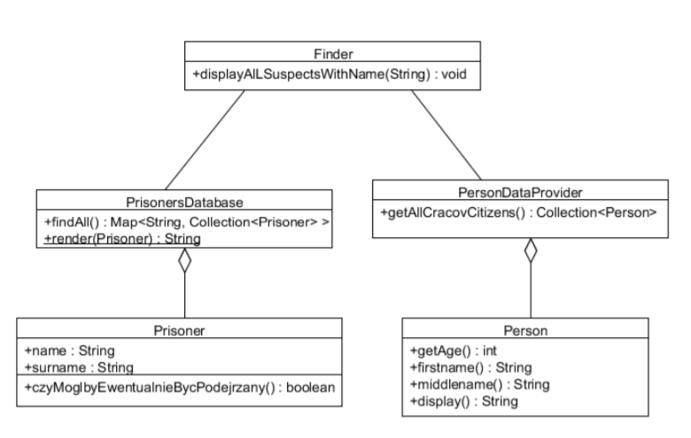
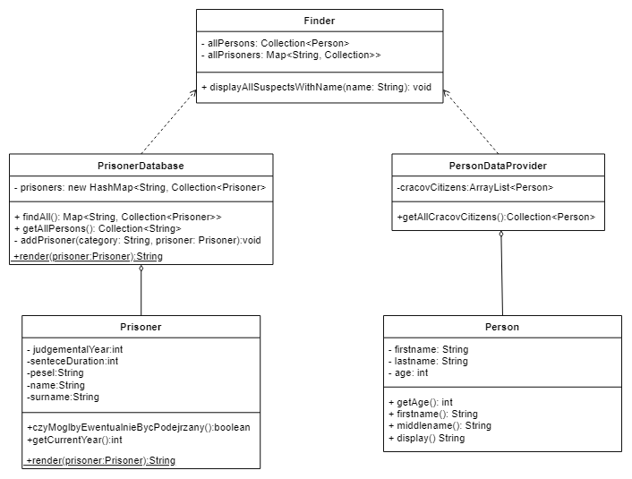

# Laboratorium 4
## Refaktoryzacja
## Autorzy Andrii Trishch, Uladzislau Tumilovich

#### Krok 1. Diagram UML:

##### Diagram podany na cwiczeniu


##### Nasz diagram:


W odrużnieniu od diagramu podanego na cwiczeniu nasz diagram wyświetlia zależność między klasami **Finder** i **PrisonerDataProvider**/**PersonDatabase**, a nie  asocjacje, bo podane wyszej klasy nie zawierają objektów klasy **Finder**.

#### Krok 2. Poprawa podstawowych blędów:

**a)** Została zmieniona klasa Prisoners. Do atrybutów **firstname**, **lastname** został zmieniony dostęp z *publicznego* na *przywatny*, z czego wynikła potrzeba stworzenia geterów, nazwa metody **display()** na **toString()**, **firstname()** na **getFirstName()**, **middleName** na **getLastName**, czy **MoglbyEwentualnieBycPodejrzany()** na **canBesuspected()**, bo jest ważne pisanie nazw wszystkich metod w jedny jężyku. 

```java
public class Prisoner {
    private final String firstName;

    private final String lastName;

    private final int judgementYear;

    private final int sentenceDuration;

    private final String pesel;

    public String getFirstName() {
        return firstName;
    }

    public String getLastName() {
        return lastName;
    }

    public Prisoner(String firstName, String lastName, String pesel, int judgementYear, int sentenceDuration) {
        this.firstName = firstName;
        this.lastName = lastName;
        this.pesel = pesel;
        this.judgementYear = judgementYear;
        this.sentenceDuration = sentenceDuration;
    }

    public String getPesel() {
        return pesel;
    }

    public boolean canBeSuspected() {
        return judgementYear + sentenceDuration >= getCurrentYear();
    }

    public int getCurrentYear() {
        return Calendar.getInstance().get(Calendar.YEAR);
    }

    public String toString() {
        return firstName+ " " + lastName;
    }
}
```

**b)** Zostala zmieniona klasa Prisoners Database. Zmieniono nazwe metody **render()** na **toString()**, **findAll()** na **getPrisoners()**, **getAllPrisons()** na **getPrisons()**.

```java
public class PrisonersDatabase {

    private final Map<String, Collection<Prisoner>> prisoners = new HashMap<String, Collection<Prisoner>>();

    public PrisonersDatabase() {
        addPrisoner("Wiezienie krakowskie", new Prisoner("Jan", "Kowalski", "87080452357", 2005, 7));
        addPrisoner("Wiezienie krakowskie", new Prisoner("Anita", "Wiercipieta", "84080452357", 2009, 3));
        addPrisoner("Wiezienie krakowskie", new Prisoner("Janusz", "Zlowieszczy", "92080445657", 2001, 10));
        addPrisoner("Wiezienie przedmiejskie", new Prisoner("Janusz", "Zamkniety", "802104543357", 2010, 5));
        addPrisoner("Wiezienie przedmiejskie", new Prisoner("Adam", "Future", "880216043357", 2020, 5));
        addPrisoner("Wiezienie przedmiejskie", new Prisoner("Zbigniew", "Nienajedzony", "90051452335", 2011, 1));
        addPrisoner("Wiezienie centralne", new Prisoner("Jan", "Przedziwny", "91103145223", 2009, 4));
        addPrisoner("Wiezienie centralne", new Prisoner("Janusz", "Podejrzany", "85121212456", 2012, 1));
    }

    public Map<String, Collection<Prisoner>> getPrisoners() {
        return prisoners;
    }

    public Collection<String> getPrisons() {
        return prisoners.keySet();
    }

    private void addPrisoner(String category, Prisoner prisoner) {
        if (!prisoners.containsKey(category))
            prisoners.put(category, new ArrayList<Prisoner>());
        prisoners.get(category).add(prisoner);
    }
}
```

**c)** Zostala zmieniona nazwa klasy **PersonDataProvider** na **PersonDatabase**. Nazwa List **cracovCitizens**na **cracovPersons**, nazwa metody **getAllCracovCitizens** na **getCracovPersons**, została stworzona metoda **addCracovPerson(firstName,lastName,age)**, żeby zmiejszyc powtorzenie kodu.

```java
public class PersonDatabase {

    private final Collection<Person> cracovPersons = new ArrayList<Person>();

    public PersonDatabase() {
        addCracovPerson("Jan", "Kowalski", 30);
        addCracovPerson("Janusz", "Krakowski", 30);
        addCracovPerson("Janusz", "Mlodociany", 10);
        addCracovPerson("Kasia", "Kosinska", 19);
        addCracovPerson("Piotr", "Zgredek", 29);
        addCracovPerson("Tomek", "Gimbus", 14);
        addCracovPerson("Janusz", "Gimbus", 15);
        addCracovPerson("Alicja", "Zaczarowana", 22);
        addCracovPerson("Janusz", "Programista", 77);
        addCracovPerson("Pawel", "Pawlowicz", 32);
        addCracovPerson("Krzysztof", "Mendel", 30);
    }

    public Collection<Person> getCracovPersons() {
        return cracovPersons;
    }
    private void addCracovPerson(String firstName,String lastName,int age){
        this.cracovPersons.add(new Person(firstName,lastName,age));
    }
}
```
**d)** Została zmieniona klasa **Person**. Atrybuty **firstname**, **lastname** zmienione na **firstName**, **lastName**, nazwa metody **firstname()** na **getFirstName()**,metody **lastname()** na **getLastName()**,
```java
public class Person {
    private String firstName;

    private String lastName;

    private int age;

    public Person(String firstName, String lastName, int age) {
        this.age = age;
        this.firstName = firstName;
        this.lastName = lastName;
    }

    public int getAge() {
        return age;
    }

    public String getFirstName() {
        return firstName;
    }

    public String getLastName() {
        return lastName;
    }

    public String toString() {
        return firstName + " " + lastName;
    }
}
```

**e)** Została zmieniona klasa **Finder**, zmiany której wynikają z wynikają z wprowadzonych powyszej modyfikacji. 
```java
public class Finder {
    private final Collection<Person> allPersons;
    private final Map<String, Collection<Prisoner>> allPrisoners;

    public Finder(Collection<Person> allPersons, Map<String, Collection<Prisoner>> allPrisoners) {
        this.allPersons = allPersons;
        this.allPrisoners = allPrisoners;
    }

    public Finder(PersonDatabase personDatabase, PrisonersDatabase prisonersDatabase) {
        this(personDatabase.getCracovPersons(), prisonersDatabase.getPrisoners());
    }

    public void displayAllSuspectsWithName(String name) {
        ArrayList<Prisoner> suspectedPrisoners = new ArrayList<Prisoner>();
        ArrayList<Person> suspectedPersons = new ArrayList<Person>();

        for (Collection<Prisoner> prisonerCollection : allPrisoners.values()) {
            for (Prisoner prisoner : prisonerCollection) {
                if (!prisoner.canBeSuspected() && prisoner.getFirstName().equals(name)) {
                    suspectedPrisoners.add(prisoner);
                }
                if (suspectedPrisoners.size() >= 10) {
                    break;
                }
            }
            if (suspectedPrisoners.size() >= 10) {
                break;
            }
        }

        if (suspectedPrisoners.size() < 10) {
            for (Person person : allPersons) {
                if (person.getAge() > 18 && person.getFirstName().equals(name)) {
                    suspectedPersons.add(person);
                }
                if (suspectedPrisoners.size() + suspectedPersons.size() >= 10) {
                    break;
                }
            }
        }

        int t = suspectedPrisoners.size() + suspectedPersons.size();
        System.out.println("Znalazlem " + t + " pasujacych podejrzanych!");

        for (Prisoner n : suspectedPrisoners) {
            System.out.println(n.toString());
        }

        for (Person p : suspectedPersons) {
            System.out.println(p.toString());
        }
    }
}
```

#### Krok 3. Propozycja generalizacji klas _Person_ i _Prisoner_

Użyliśmy klasy abstrakcyjnej dla generalizacji klas _Person_ i _Prisoner_. Swój wybór uzasadniamy tym, że implementacja większości metod jest dokładnie taka sama i nie ma wielkiego sensu w stosowaniu interfejsu. Nie skorzystaliśmy z interfejsu z metodami domyślnymi bo pola przechowywane w interfejsie muszą być _final static_ co nie jest idealnym rozwiązaniem dla tego przypadku, klasa abstrakcyjna na odwrót, spełnia wszystkie warunki i idealnie pasuje do tego przypadku. Więcej tego, do klasy abstrakcyjnej _Suspect_ dodaliśmy metodę _canBeSuspected_ która jest metodą abstrakcyjną, zrobione to po to, żeby uogólnić klasę _Finder_ i uprościć metodę _displayAllSuspectsWithName_.

**Suspect abstract class**
````java
public abstract class Suspect {

    protected String firstName;
    protected String lastName;

    public String getFirstName() { return this.firstName; }

    public String getLastName() { return this.lastName; }

    public String toString() {
        return this.firstName + " " + this.lastName;
    }

    public abstract boolean canBeSuspected();
}
````

**Person class**
````java
public class Person extends Suspect {
    private int age;

    public Person(String firstName, String lastName, int age) {
        this.age = age;
        this.firstName = firstName;
        this.lastName = lastName;
    }

    public int getAge() {
        return age;
    }

    public boolean canBeSuspected() {
        return age > 18;
    }
}
````


**Prisoner class**
````java
public class Prisoner extends Suspect {
    private final int judgementYear;
    private final int sentenceDuration;
    private final String pesel;

    public Prisoner(String firstName, String lastName, String pesel, int judgementYear, int sentenceDuration) {
        this.judgementYear = judgementYear;
        this.sentenceDuration = sentenceDuration;
        this.pesel = pesel;
        this.firstName = firstName;
        this.lastName = lastName;
    }

    public String getPesel() {
        return this.pesel;
    }

    public boolean canBeSuspected() {
        return judgementYear + sentenceDuration >= getCurrentYear();
    }

    private int getCurrentYear() {
        return Calendar.getInstance().get(Calendar.YEAR);
    }
}
````

**Finder class**
````java
public class Finder {
    private final Collection<Person> allPersons;

    private final Map<String, Collection<Prisoner>> allPrisoners;

    public Finder(Collection<Person> allPersons, Map<String, Collection<Prisoner>> allPrisoners) {
        this.allPersons = allPersons;
        this.allPrisoners = allPrisoners;
    }

    public Finder(PersonDatabase personDatabase, PrisonersDatabase prisonersDatabase) {
        this(personDatabase.getCracovPersons(), prisonersDatabase.getPrisoners());
    }

    public void displayAllSuspectsWithName(String name) {
        ArrayList<Suspect> suspectedPersons = new ArrayList<Suspect>();

        for (Collection<Prisoner> prisonerCollection : allPrisoners.values()) {
            for (Prisoner prisoner : prisonerCollection) {
                if (!prisoner.canBeSuspected() && prisoner.getFirstName().equals(name)) {
                    suspectedPersons.add(prisoner);
                }
                if (suspectedPersons.size() >= 10) {
                    break;
                }
            }
            if (suspectedPersons.size() >= 10) {
                break;
            }
        }

        if (suspectedPersons.size() < 10) {
            for (Person person : allPersons) {
                if (person.canBeSuspected() && person.getFirstName().equals(name)) {
                    suspectedPersons.add(person);
                }
                if (suspectedPersons.size() >= 10) {
                    break;
                }
            }
        }

        System.out.println("Znalazlem " + suspectedPersons.size() + " pasujacych podejrzanych!");

        for (Suspect suspect: suspectedPersons) {
            System.out.println(suspect.toString());
        }
    }
}
````
