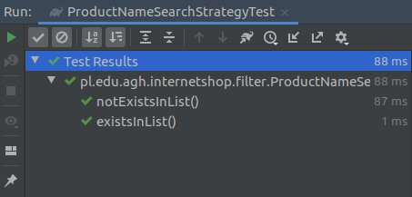
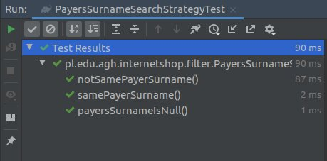
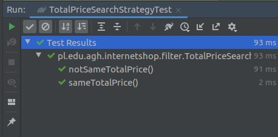
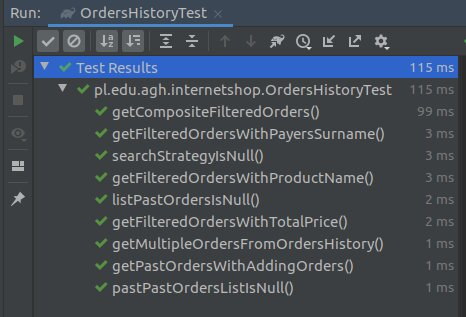
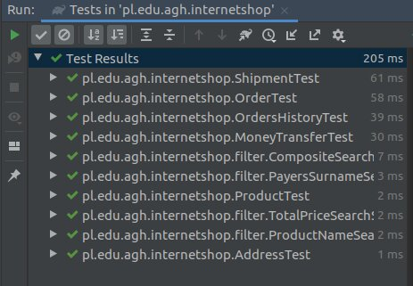

# Laboratorium 5
## Testy jednostkowe
## Autorzy: Andrii Trishch, Uladzislau Tumilovich


#### Krok 1. Zmiana wartości procentowej z _22_ na _23_:

**a)** Została zamieniona wartość oczekiwana testu _testPriceWithTexesWithoutRoundUp_ z _2.44_ na _2.46_


```java
public class OrderTest {
  
  ...
  
	@Test
	public void testPriceWithTaxesWithoutRoundUp() {
		// given

		// when
		Order order = getOrderWithCertainProductPrice(2); // 2 PLN

		// then
		assertBigDecimalCompareValue(order.getPriceWithTaxes(), BigDecimal.valueOf(2.46)); // 2.46 PLN
	}
  
  ...
}
```

**b)** W klasie **Order** zostało zmienione pole _TAX_VALUE_ z _BigDecimal.valueOf(1.22)_ na _BigDecimal.valueOf(1.23)_

```java
public class Order {
  private static final BigDecimal TAX_VALUE = BigDecimal.valueOf(1.23);
 
  ...
}
```

**c)** Po uruchomieniu wszystkich testów


#### Krok 2. Rozszerzenie funkcjalności systemu:

**a)** W klasie **Order** zostało usunięte pole _product_ oraz zostały zmienione wszystkie metody, które korzystają z tego pola w taki sposób, żeby w przyszłości mogły one pracować z listą produktów.

```java
public class Order {
    private static final BigDecimal TAX_VALUE = BigDecimal.valueOf(1.23);
	private final UUID id;
    // private final Product product;
    private boolean paid;
    private Shipment shipment;
    private ShipmentMethod shipmentMethod;
    private PaymentMethod paymentMethod;

    public Order(List<Product> product) {
        // this.product = product;
        id = UUID.randomUUID();
        paid = false;
    }

    public UUID getId() {
        return id;
    }

    public void setPaymentMethod(PaymentMethod paymentMethod) {
        this.paymentMethod = paymentMethod;
    }

    public PaymentMethod getPaymentMethod() {
        return paymentMethod;
    }

    public boolean isSent() {
        return shipment != null && shipment.isShipped();
    }

    public boolean isPaid() { return paid; }

    public Shipment getShipment() {
        return shipment;
    }

    public BigDecimal getPrice() {
        return null; //product.getPrice();
    }

    public BigDecimal getPriceWithTaxes() {
        return getPrice().multiply(TAX_VALUE).setScale(Product.PRICE_PRECISION, Product.ROUND_STRATEGY);
    }

    public List<Product> getProducts() {
        return null;
    }

    public ShipmentMethod getShipmentMethod() {
        return shipmentMethod;
    }

    public void setShipmentMethod(ShipmentMethod shipmentMethod) {
        this.shipmentMethod = shipmentMethod;
    }

    public void send() {
        boolean sentSuccesful = getShipmentMethod().send(shipment, shipment.getSenderAddress(), shipment.getRecipientAddress());
        shipment.setShipped(sentSuccesful);
    }

    public void pay(MoneyTransfer moneyTransfer) {
        moneyTransfer.setCommitted(getPaymentMethod().commit(moneyTransfer));
        paid = moneyTransfer.isCommitted();
    }

    public void setShipment(Shipment shipment) {
        this.shipment = shipment;
    }
}
```

Została zmodyfikowana klasa **OrderTest**, zmiany wynikają ze zmiany pola *product* z obiektu klasy **Product** do listy **List Product**
	
```java
public class OrderTest {

    ...

    private Order getOrderWithMockedProduct() {
        Product product = mock(Product.class);
        return new Order(Collections.singletonList(product));
    }

    @Test
    public void testGetProductThroughOrder() {
        // given
        Product expectedProduct = mock(Product.class);
        Order order = new Order(Collections.singletonList(expectedProduct));

        // when
        List<Product> actualProducts = order.getProducts();

        // then
        assertSame(expectedProduct, actualProducts.get(0));
    }

    @Test
    public void testGetPrice() throws Exception {
        // given
        BigDecimal expectedProductPrice = BigDecimal.valueOf(1000);
        Product product = mock(Product.class);
        given(product.getPrice()).willReturn(expectedProductPrice);
        Order order = new Order(Collections.singletonList(product));

        // when
        BigDecimal actualProductPrice = order.getPrice();

        // then
        assertBigDecimalCompareValue(expectedProductPrice, actualProductPrice);
    }
    
    ...
}
```

**c)** Następnie została zmodyfikowana klasa **Order** w taki sposób, żeby przechodziły już wcześniej poprawione testy.

```java
public class Order {
    private static final BigDecimal TAX_VALUE = BigDecimal.valueOf(1.23);
    private final UUID id;
    private final List<Product> products;
    private boolean paid;
    private Shipment shipment;
    private ShipmentMethod shipmentMethod;
    private PaymentMethod paymentMethod;

    public Order(List<Product> products) {
        this.products = products;
        id = UUID.randomUUID();
        paid = false;
    }

    public UUID getId() {
        return id;
    }

    public void setPaymentMethod(PaymentMethod paymentMethod) {
        this.paymentMethod = paymentMethod;
    }

    public PaymentMethod getPaymentMethod() {
        return paymentMethod;
    }

    public boolean isSent() {
        return shipment != null && shipment.isShipped();
    }

    public boolean isPaid() { return paid; }

    public Shipment getShipment() {
        return shipment;
    }

    public BigDecimal getPrice() {
        BigDecimal price = BigDecimal.valueOf(0.0);
        for (Product product: products) {
            price = price.add(product.getPrice());
        }
        return price;
    }

    public BigDecimal getPriceWithTaxes() {
        return getPrice().multiply(TAX_VALUE).setScale(Product.PRICE_PRECISION, Product.ROUND_STRATEGY);
    }

    public List<Product> getProducts() {
        return products;
    }

    public ShipmentMethod getShipmentMethod() {
        return shipmentMethod;
    }

    public void setShipmentMethod(ShipmentMethod shipmentMethod) {
        this.shipmentMethod = shipmentMethod;
    }

    public void send() {
        boolean sentSuccesful = getShipmentMethod().send(shipment, shipment.getSenderAddress(),shipment.getRecipientAddress());
        shipment.setShipped(sentSuccesful);
    }

    public void pay(MoneyTransfer moneyTransfer) {
        moneyTransfer.setCommitted(getPaymentMethod().commit(moneyTransfer));
        paid = moneyTransfer.isCommitted();
    }

    public void setShipment(Shipment shipment) {
        this.shipment = shipment;
    }
}
```

**d)** Po uruchomieniu wszystkich testów


**e)** Dodano poszczególne testy do **OrderTest**:  
* **getMultipleProdutFromOrder** - sprawdza, czy rzeczywiście przekazane **List Product** określoną długość.
```java
@Test
public void getMultipleProductFromOrder() {
	// given
	Product expectedProduct = mock(Product.class);
	Product expectedProduct1 = mock(Product.class);

	// when
	Order order = new Order(Arrays.asList(expectedProduct, expectedProduct1));

	// then
	assertSame(expectedProduct, order.getProducts().get(0));
	assertSame(expectedProduct1, order.getProducts().get(1));
	assertEquals(order.getProducts().size(), order.getProducts().size());
}
```
* **productsListIsNull** - sprawdza, czy przy tworzeniu **Order** wrzuca wyjątek, jeżeli przekazana lista mieści product, jaki jest **null**-em.
```java
@Test
public void listProductIsNull() {
	// given
	List<Product> products = Arrays.asList(mock(Product.class), null);

	// when then
	assertThrows(NullPointerException.class, () -> new Order(products));
}
```
* **listProductIsNull** - sprawdza, czy przy tworzeniu **Order** wrzuca wyjątek, jeżeli przekazana lista jest **null**-em.
```java
@Test
public void productsListIsNull() {
	// when then
	assertThrows(NullPointerException.class, () -> new Order(null));
}
```

**f)** Został zmieniony konstruktor klasy **Order** dla sprawdzania poszczególnych warunków.
```java
public Order(List<Product> products) {
	products.forEach((p)->Objects.requireNonNull(p,"product cannot be null"));
	this.products = Objects.requireNonNull(products, "products list cannot be null");
	id = UUID.randomUUID();
	paid = false;
}
```

**g)** Po uruchomieniu wszystkich testów **OrderTest**


#### Krok 3. Dodanie możliwości dodawania rabatu do produktu i całego zamówienia:

**a)** Został dodany atrybut _discount_ do klasy **Product** odpowiednie _Gettery_ i _Settery_ oraz funkcja getPriceWithDiscount()_
```java 
public class Product {

    public static final int PRICE_PRECISION = 2;
    public static final int ROUND_STRATEGY = BigDecimal.ROUND_HALF_UP;

    private final String name;
    private final BigDecimal price;
    private final BigDecimal discount;

    public Product(String name, BigDecimal price, BigDecimal discount) {
        this.name = name;
        this.price = price;
        this.discount = discount;
        this.price.setScale(PRICE_PRECISION, ROUND_STRATEGY);
    }

    public String getName() {
        return name;
    }

    public BigDecimal getPrice() {
        return price;
    }

    public BigDecimal getDiscount() { return discount; }

    public BigDecimal getPriceWithDiscount() {
        return getPrice().subtract(getPrice().multiply(discount).setScale(PRICE_PRECISION, ROUND_STRATEGY));
    }
}
```

**b)** Zostały dopasowane testy do wprowadzonych powyżej zmian oraz zostały dodane nowe:
* _getProductDiscount_ - sprawdza poprawność przypisania zniżki.
* _getProductWithDiscount()_ - sprawdza poprawność wyliczonej ceny z rabatem.
```java
public class ProductTest {
    private static final String NAME = "Mr. Sparkle";
    private static final BigDecimal PRICE = BigDecimal.valueOf(1);
    private static final BigDecimal DISCOUNT = BigDecimal.valueOf(0);

    @Test
    public void testProductName() throws Exception {
        // given

        // when
        Product product = new Product(NAME, PRICE, DISCOUNT);

        // then
        assertEquals(NAME, product.getName());
    }

    @Test
    public void testProductPrice() throws Exception {
        // given

        // when
        Product product = new Product(NAME, PRICE, PRICE);

        // then
        assertBigDecimalCompareValue(product.getPrice(), PRICE);
    }

    @Test
    public void getProductDiscount() throws Exception {
        // given
        BigDecimal discount = BigDecimal.valueOf(0.05);

        // when
        Product product = new Product(NAME, PRICE, discount);

        // then
        assertBigDecimalCompareValue(product.getDiscount(), discount);
    }

    @Test
    public void getProductPriceWithDiscount() throws Exception {
        // given

        // when
        Product product = new Product(NAME, PRICE, BigDecimal.valueOf(0.1));

        // then
        assertBigDecimalCompareValue(product.getPriceWithDiscount(), BigDecimal.valueOf(0.9));
    }
}
```

**c)** Po uruchomieniu wszystkich testów **ProductTest**


**d)**  
Został dodany atrybut _discount_ do klasy **Order**, odpowiednie _Gettery_ i _Settery_ oraz funkcji
* _getPriceWithDiscount()_- oblicza wartość zamówienia ze zniżką
* _getPriceWithProductDiscount()_- oblicza wartość zamówienia ze zniżką na poszczególne produkty
Oraz zmieniono funkcje
* _getPriceWithTaxes()_- oblicza wartość zamówienia ze zniżką i podatkiem.  

```java
public class Order {
    private static final BigDecimal TAX_VALUE = BigDecimal.valueOf(1.23);
	private final UUID id;
    private final List<Product> products;
    private boolean paid;
    private Shipment shipment;
    private ShipmentMethod shipmentMethod;
    private PaymentMethod paymentMethod;
    private BigDecimal discount;

    public Order(List<Product> products) {
        this.products = Objects.requireNonNull(products, "product cannot be null");
        this.products.forEach((p) -> Objects.requireNonNull(p,"product cannot be null"));
        id = UUID.randomUUID();
        paid = false;
    }

    public BigDecimal getPrice() {
        BigDecimal price = BigDecimal.valueOf(0.0);
        for (Product product: products) {
            price = price.add(product.getPrice());
        }
        return price;
    }

    public BigDecimal getPriceWithProductDiscount() {
        BigDecimal price = BigDecimal.valueOf(0.0);
        for (Product product: products) {
            price = price.add(product.getPriceWithDiscount());
        }
        return price;
    }

    public BigDecimal getPriceWithDiscount() {
        if (discount != null) {
            return getPriceWithProductDiscount()
                    .subtract(getPriceWithProductDiscount().multiply(discount)
                    .setScale(Product.PRICE_PRECISION, Product.ROUND_STRATEGY));
        }
        return getPriceWithProductDiscount();
    }

    public BigDecimal getPriceWithTaxes() {
        return getPriceWithDiscount().multiply(TAX_VALUE).setScale(Product.PRICE_PRECISION, Product.ROUND_STRATEGY);
    }

    public void send() {
        boolean sentSuccessful = getShipmentMethod().send(shipment, shipment.getSenderAddress(), shipment.getRecipientAddress());
        shipment.setShipped(sentSuccessful);
    }

    public void pay(MoneyTransfer moneyTransfer) {
        moneyTransfer.setCommitted(getPaymentMethod().commit(moneyTransfer));
        paid = moneyTransfer.isCommitted();
    }

    public UUID getId() {
        return id;
    }

    public boolean isSent() {
        return shipment != null && shipment.isShipped();
    }

    public boolean isPaid() { return paid; }

    public void setShipment(Shipment shipment) {
        this.shipment = shipment;
    }

    public Shipment getShipment() {
        return shipment;
    }

    public void setDiscount(BigDecimal discount) { this.discount = discount; }

    public BigDecimal getDiscount() {
        return discount;
    }    

    public void setPaymentMethod(PaymentMethod paymentMethod) {
        this.paymentMethod = paymentMethod;
    }

    public PaymentMethod getPaymentMethod() {
        return paymentMethod;
    }

    public void setShipmentMethod(ShipmentMethod shipmentMethod) {
        this.shipmentMethod = shipmentMethod;
    }

    public ShipmentMethod getShipmentMethod() {
        return shipmentMethod;
    }

    public List<Product> getProducts() {
        return products;
    }
}
```

**e)** Zostały dopasowane testy do wprowadzonych powyżej zmian.

* **setDiscount** - sprawdza poprawność przypisania rabatu.
```java
@Test
public void setDiscount() throws Exception {
	// given
	Order order = getOrderWithMockedProduct();
	BigDecimal expectedDiscount = BigDecimal.valueOf(0.05);

	// when
	order.setDiscount(expectedDiscount);

	// then
	assertBigDecimalCompareValue(expectedDiscount, order.getDiscount());
}
```

* **getDiscountWithoutSetting** - sprawdza poprawność zwracanego rabatu bez jego wcześniejszego przypisania.
```java
@Test
public void getDiscountWithoutSetting() throws Exception {
	// given
	Order order = getOrderWithMockedProduct();

	// when

	// then
	assertNull(order.getDiscount());
}
```

* **getPriceWithProductDiscount** - sprawdza poprawność obliczenia sumy poszczególnych produktów ze zniżką.
```java
@Test
public void getPriceWithProductDiscount() {
	// given
	Product product = mock(Product.class);
	Product product1 = mock(Product.class);

	BigDecimal expectedOrderPrice = BigDecimal.valueOf(1.7);

	given(product.getPriceWithDiscount()).willReturn(BigDecimal.valueOf(0.9));
	given(product1.getPriceWithDiscount()).willReturn(BigDecimal.valueOf(0.8));

	// when
	Order order = new Order(Arrays.asList(product, product1), DISCOUNT);

	// then
	assertBigDecimalCompareValue(expectedOrderPrice, order.getPriceWithProductDiscount());
}
```

* **getPriceWithTaxes** - sprawdza poprawność obliczenia sumy zamówienia ze zniżką i podatkiem.
```java
@Test
public void getPriceWithTaxes() {
	double productPriceValue=1000;
	double productDiscountValue=0.10;
	Order order=getOrderWithCertainProductPriceDiscount(productPriceValue,productDiscountValue);
	BigDecimal expectedFinalPrice=BigDecimal.valueOf(productPriceValue).subtract(BigDecimal.valueOf(productPriceValue*productDiscountValue)).multiply(BigDecimal.valueOf(1.23));
	System.out.println(order.getPriceWithDiscount());
	assertBigDecimalCompareValue(order.getPriceWithTaxes(),expectedFinalPrice);
}
```

* **getPriceWithMultiplyProducts** - sprawdza, czy zwrócona suma dla dwóch produktów jest poprawna.
```java 
@Test
public void getPriceWithMultiplyProducts(){
	// given
	Product product = mock(Product.class);
	Product product1 = mock(Product.class);

	BigDecimal expectedProductPrice = BigDecimal.valueOf(1500);

	given(product.getPrice()).willReturn(BigDecimal.valueOf(1000));
	given(product1.getPrice()).willReturn(BigDecimal.valueOf(500));

	// when
	Order order = new Order(Arrays.asList(product, product1), DISCOUNT);

	//then
	assertBigDecimalCompareValue(expectedProductPrice, order.getPrice());
}
```
**f)** Po uruchomieniu wszystkich testów **OrderTest**  


#### Krok 4. Dodanie historii zamówień:

**a)** Został stworzony interfejs **SearchStrategy**
```java
public interface SearchStrategy {
    boolean filter(Order order);
}
```

**b)** Następnie została stworzona klasa **ProductNameSearchStrategy**, która implementuje interfejs **SearchStrategy** i realizuję zadaną logikę filtrowania.
```java
public class ProductNameSearchStrategy implements SearchStrategy {
    private String name;

    public ProductNameSearchStrategy(String name) {
        this.name = name;
    }

    @Override
    public boolean filter(Order order) {
        List<Product> products = order.getProducts();
        for (Product product: products) {
            if (product.getName().equals(this.name)) {
                return true;
            }
        }
        return false;
    }
}
```

**c)** Analogicznie do klasy **ProductNameSearchStrategy** została stworzona klasa **TotalPriceSearchStrategy**. 
```java
public class TotalPriceSearchStrategy implements SearchStrategy {
    BigDecimal price;

    public TotalPriceSearchStrategy(BigDecimal price) {
        this.price = price;
    }

    @Override
    public boolean filter(Order order) {
        return order.getPriceWithTaxes().compareTo(this.price) == 0;
    }
}
```

**d)** W taki samy spośob zostałą dodana i klasa **PayersSurnameSearchStrategy**
```java
public class PayersSurnameSearchStrategy implements SearchStrategy {
    private String payersSurname;

    public PayersSurnameSearchStrategy(String payersSurname) {
        this.payersSurname = payersSurname;
    }

    @Override
    public boolean filter(Order order) {
        if (order.getOrdersPayerSurname() != null) {
            return order.getOrdersPayerSurname().equals(this.payersSurname);
        }
        return false;
    }
}
```

**e)** Została stworzona klasa **CompositeSearchStrategy** która pozwala na filtrowanie zamówień po więcej niż jednym parametru.
```java
public class CompositeSearchStrategy implements SearchStrategy {
    private final List<SearchStrategy> filters;

    public CompositeSearchStrategy(List<SearchStrategy> filters) {
        this.filters = filters;
    }

    @Override
    public boolean filter(Order order) {
        return filters.stream().allMatch(f -> f.filter(order));
    }
}
```

**f)** Została stworzona klasa **OrdersHistory** dla przechowywania wszystkich zrobionych zamówień, a też otrzymania wszystkich zamówień w zależności od wybranego filtr (-ów).
```java 
public class OrdersHistory {
    private final List<Order> pastOrders;

    public OrdersHistory(List<Order> pastOrders) {
        this.pastOrders = Objects.requireNonNull(pastOrders, "pastOrders cannot be null");
        this.pastOrders.forEach((p) -> Objects.requireNonNull(p,"order cannot be null"));
    }

    public void addOrder(Order order){
        this.pastOrders.add(order);
    }

    public List<Order> getPastOrders() {
        return pastOrders;
    }

    public List<Order> getFilteredOrders(SearchStrategy searchStrategy) {
        List<Order> resultList = new ArrayList<>();
        for (Order order: pastOrders) {
            if (searchStrategy.filter(order)) {
                resultList.add(order);
            }
        }
        return resultList;
    }
}
```

**g)** Została stworzona klasa **ProductNameSearchStrategyTest**, testująca klasę **ProductSearchStrategy** z metodami:
* _getMockedOrder()_ - zwraca mockowany obiekt klasy **Order**
* _existsInList()_ - sprawdza poprawność działania metody _filter()_ jeśli lista produktów zawiera produkt o podanej nazwie
* notExistsInList()_ - sprawdza poprawność działania metody _filter()_ jeśli lista produktów zawiera produkt o podanej nazwie
	
```java
public class ProductNameSearchStrategyTest {
    private Order getMockedOrder() {
        Order order = mock(Order.class);
        List<Product> productList = Arrays.asList(
                new Product("Banana", BigDecimal.valueOf(43.05), BigDecimal.valueOf(0.5)),
                new Product("Orange", BigDecimal.valueOf(54.83), BigDecimal.valueOf(0.23))
        );
        given(order.getProducts()).willReturn(productList);
        return order;
    }

    @Test
    public void existsInList() {
        // given
        Order order = getMockedOrder();

        // when
        ProductNameSearchStrategy searchStrategy = new ProductNameSearchStrategy("Banana");

        // then
        assertTrue(searchStrategy.filter(order));
    }

    @Test
    public void notExistsInList() {
        // given
        Order order = getMockedOrder();

        // when
        ProductNameSearchStrategy searchStrategy = new ProductNameSearchStrategy("Apple");

        // then
        assertFalse(searchStrategy.filter(order));
    }
}
```

Po uruchomieniu wszystkich testów **ProductNameSearchStrategyTest**  



**h)** Została stworzona klasa **PayersSurnameSearchStrategyTest**, testująca klasę **PayersSurnameSearchStrategy** z metodami:
* _samePayerSurname()_ - sprawdza poprawność działania metody _filter()_ jeśli nazwisko płatniku dopasuję się z podanym
* _notSamePayerSurname()_ - sprawdza poprawność działania metody _filter()_ jeśli nazwisko płatniku nie dopasuję się z podanym
* payersSurnameIsNull()_ - sprawdza poprawność działania metody _filter()_ jeśli pole nazwiska jest nulem
	
	
```java
public class PayersSurnameSearchStrategyTest {

    @Test
    public void samePayerSurname() {
        // given
        Order order = mock(Order.class);
        given(order.getOrdersPayerSurname()).willReturn("Surname");

        // when
        PayersSurnameSearchStrategy searchStrategy = new PayersSurnameSearchStrategy("Surname");

        // then
        assertTrue(searchStrategy.filter(order));
    }

    @Test
    public void notSamePayerSurname() {
        // given
        Order order = mock(Order.class);
        given(order.getOrdersPayerSurname()).willReturn("notSurname");

        // when
        PayersSurnameSearchStrategy searchStrategy = new PayersSurnameSearchStrategy("Surname");

        // then
        assertFalse(searchStrategy.filter(order));
    }

    @Test
    public void payersSurnameIsNull() {
        // given
        Order order = mock(Order.class);
        given(order.getOrdersPayerSurname()).willReturn(null);

        // when
        PayersSurnameSearchStrategy searchStrategy = new PayersSurnameSearchStrategy("Surname");

        // then
        assertFalse(searchStrategy.filter(order));
    }
}
```

Po uruchomieniu wszystkich testów **PayersSurnameSearchStrategyTest**  



**i)** Została stworzona klasa **TotalPriceSearchStrategyTest**, testująca klasę **TotalPriceSearchStrategy** z metodami:
* _getMockedOrder()_ - zwraca mockowany obiekt klasy **Order**
* _sameTotalPrice()_ - sprawdza poprawność działania metody _filter()_ jeśli total price dopasuję się z podanym
* _notSameTotalPrice()_ - sprawdza poprawność działania metody _filter()_ jeśli total price nie dopasuję się z podanympodanym
	
	
```java
public class TotalPriceSearchStrategyTest {
    private Order getMockedOrder() {
        Order order = mock(Order.class);
        given(order.getPriceWithTaxes()).willReturn(BigDecimal.valueOf(10));
        return order;
    }

    @Test
    public void sameTotalPrice() {
        // given
        Order order = getMockedOrder();

        // when
        TotalPriceSearchStrategy searchStrategy = new TotalPriceSearchStrategy(BigDecimal.valueOf(10));

        // then
        assertTrue(searchStrategy.filter(order));
    }

    @Test
    public void notSameTotalPrice() {
        // given
        Order order = getMockedOrder();

        // when
        TotalPriceSearchStrategy searchStrategy = new TotalPriceSearchStrategy(BigDecimal.valueOf(9));

        // then
        assertFalse(searchStrategy.filter(order));
    }
}
```

Po uruchomieniu wszystkich testów **TotalPriceSearchStrategyTest**  



**j)** Została stworzona klasa **CompositeSearchStrategyTest**, testująca klasę **CompositeSearchStrategy** z metodami:
* _getMockedOrder()_ - zwraca mockowany obiekt klasy **Order**
* _sameAllParameters()_ - sprawdza poprawność działania metody _filter()_ jeśli wszystkie dane dopasują się z podanymi
* _sameAllParametersNotProductName()_ - sprawdza poprawność działania metody _filter()_ jeśli wszystkie dane dopasują się z podanymi się z podanympodanym oprócz nazw produktów
* _sameAllParametersNotPayersSurname()_ - sprawdza poprawność działania metody _filter()_ jeśli wszystkie dane dopasują się z podanymi się z podanympodanym oprócz nazwiska płatnika
* _sameAllParametersNotTotalPrice()_ - sprawdza poprawność działania metody _filter()_ jeśli wszystkie dane dopasują się z podanymi się z podanympodanym oprócz total price
	
	
```java
public class CompositeSearchStrategyTest {
    private Order getMockedOrder() {
        Order order = mock(Order.class);
        List<Product> productList = Arrays.asList(
                new Product("Banana", BigDecimal.valueOf(43.05), BigDecimal.valueOf(0.5)),
                new Product("Orange", BigDecimal.valueOf(54.83), BigDecimal.valueOf(0.23))
        );
        given(order.getProducts()).willReturn(productList);
        given(order.getPriceWithTaxes()).willReturn(BigDecimal.valueOf(10));
        given(order.getOrdersPayerSurname()).willReturn("Surname");
        return order;
    }

    @Test
    public void sameAllParameters() {
        // given
        Order order = getMockedOrder();
        SearchStrategy productNameSearchStrategy = new ProductNameSearchStrategy("Banana");
        SearchStrategy payersSurnameSearchStrategy = new PayersSurnameSearchStrategy("Surname");
        SearchStrategy totalPriceSearchStrategy = new TotalPriceSearchStrategy(BigDecimal.valueOf(10));

        // when
        CompositeSearchStrategy searchStrategy = new CompositeSearchStrategy(
                Arrays.asList(productNameSearchStrategy, payersSurnameSearchStrategy, totalPriceSearchStrategy));

        // then
        assertTrue(searchStrategy.filter(order));
    }

    @Test
    public void sameAllParametersNotProductName() {
        // given
        Order order = getMockedOrder();
        SearchStrategy productNameSearchStrategy = new ProductNameSearchStrategy("Apple");
        SearchStrategy payersSurnameSearchStrategy = new PayersSurnameSearchStrategy("Surname");
        SearchStrategy totalPriceSearchStrategy = new TotalPriceSearchStrategy(BigDecimal.valueOf(10));

        // when
        CompositeSearchStrategy searchStrategy = new CompositeSearchStrategy(
                Arrays.asList(productNameSearchStrategy, payersSurnameSearchStrategy, totalPriceSearchStrategy));

        // then
        assertFalse(searchStrategy.filter(order));
    }

    @Test
    public void sameAllParametersNotPayersSurname() {
        // given
        Order order = getMockedOrder();
        SearchStrategy productNameSearchStrategy = new ProductNameSearchStrategy("Orange");
        SearchStrategy payersSurnameSearchStrategy = new PayersSurnameSearchStrategy("notSurname");
        SearchStrategy totalPriceSearchStrategy = new TotalPriceSearchStrategy(BigDecimal.valueOf(10));

        // when
        CompositeSearchStrategy searchStrategy = new CompositeSearchStrategy(
                Arrays.asList(productNameSearchStrategy, payersSurnameSearchStrategy, totalPriceSearchStrategy));

        // then
        assertFalse(searchStrategy.filter(order));
    }

    @Test
    public void sameAllParametersNotTotalPrice() {
        // given
        Order order = getMockedOrder();
        SearchStrategy productNameSearchStrategy = new ProductNameSearchStrategy("Orange");
        SearchStrategy payersSurnameSearchStrategy = new PayersSurnameSearchStrategy("Surname");
        SearchStrategy totalPriceSearchStrategy = new TotalPriceSearchStrategy(BigDecimal.valueOf(9));

        // when
        CompositeSearchStrategy searchStrategy = new CompositeSearchStrategy(
                Arrays.asList(productNameSearchStrategy, payersSurnameSearchStrategy, totalPriceSearchStrategy));

        // then
        assertFalse(searchStrategy.filter(order));
    }
}
```

Po uruchomieniu wszystkich testów **CompositeSearchStrategyTest**  


**k)** Została stworzona klasa **OrdersHistoryTest**, testująca klasę **OrdersHistory** z metodami:
* _getMultipleOrdersFromOrdersHistory()_ - sprawdza poprawność działania metody _getPastOrders()_
* _getPastOrdersWithAddingOrders()_ - sprawdza poprawność działania metody _addOrder()_
* _pastPastOrdersListIsNull()_ - sprawdza warunek przekazywanie nula podczas tworzenia obiektu klasy
* _listPastOrdersIsNull()_ - sprawdza warunek przekazywanie listy z zawartym nulem podczas tworzenia obiektu klasy
* _getFilteredOrdersWithProductName()_ - sprawdza działanie metody _getFilteredOrders()_ przy sortowaniu po nazwie produktu
* _getFilteredOrdersWithPayersSurname()_ - sprawdza działanie metody _getFilteredOrders()_ przy sortowaniu po nazwisku płatniku
* _getFilteredOrdersWithTotalPrice()_ - sprawdza działanie metody _getFilteredOrders()_ przy sortowaniu po total price
* _getCompositeFilteredOrders()_ - sprawdza działanie metody _getFilteredOrders()_ przy sortowaniu po wszystkich polach
* _searchStrategyIsNull()_ - sprawdza warunek przekazywanie nula podczas uruchomienia metody _getFilteredOrders()_
```java
public class OrdersHistoryTest {
    @Test
    void getMultipleOrdersFromOrdersHistory() {
        // given
        List<Order> orders = Arrays.asList(mock(Order.class), mock(Order.class));

        // when
        OrdersHistory ordersHistory = new OrdersHistory(orders);

        // then
        assertEquals(2, ordersHistory.getPastOrders().size());
        assertSame(orders.get(0), ordersHistory.getPastOrders().get(0));
        assertSame(orders.get(1), ordersHistory.getPastOrders().get(1));
    }

    @Test
    void getPastOrdersWithAddingOrders() {
        // given
        Order expectedOrder = mock(Order.class);

        // when
        OrdersHistory ordersHistory = new OrdersHistory(new ArrayList<>());
        ordersHistory.addOrder(expectedOrder);

        // then
        assertEquals(1, ordersHistory.getPastOrders().size());
        assertSame(expectedOrder, ordersHistory.getPastOrders().get(0));
    }

    @Test
    public void pastPastOrdersListIsNull() {
        // when then
        assertThrows(NullPointerException.class, () -> new OrdersHistory(null));
    }

    @Test
    public void listPastOrdersIsNull() {
        // given
        List<Order> pastOrders = Arrays.asList(mock(Order.class), null);

        // when then
        assertThrows(NullPointerException.class, () -> new OrdersHistory(pastOrders));
    }

    @Test
    void getFilteredOrdersWithProductName() {
        // given
        Product product = mock(Product.class);
        Product product1 = mock(Product.class);
        Product product2 = mock(Product.class);
        Product product3 = mock(Product.class);

        given(product.getName()).willReturn("Apple");
        given(product1.getName()).willReturn("Banana");
        given(product2.getName()).willReturn("Orange");
        given(product3.getName()).willReturn("Lemon");

        Order order = mock(Order.class);
        Order order1 = mock(Order.class);
        Order order2 = mock(Order.class);

        given(order.getProducts()).willReturn(Arrays.asList(product, product1));
        given(order1.getProducts()).willReturn(Arrays.asList(product1, product3));
        given(order2.getProducts()).willReturn(Arrays.asList(product, product1, product2, product3));

        SearchStrategy searchStrategy = new ProductNameSearchStrategy("Apple");

        // when
        OrdersHistory ordersHistory = new OrdersHistory(Arrays.asList(order, order1, order2));

        // then
        assertEquals(2, ordersHistory.getFilteredOrders(searchStrategy).size());
        assertSame(order, ordersHistory.getFilteredOrders(searchStrategy).get(0));
        assertSame(order2, ordersHistory.getFilteredOrders(searchStrategy).get(1));
    }

    @Test
    void getFilteredOrdersWithPayersSurname() {
        // given
        Order order = mock(Order.class);
        Order order1 = mock(Order.class);
        Order order2 = mock(Order.class);

        given(order.getOrdersPayerSurname()).willReturn("Surname1");
        given(order1.getOrdersPayerSurname()).willReturn("Surname2");
        given(order2.getOrdersPayerSurname()).willReturn("Surname1");

        SearchStrategy searchStrategy = new PayersSurnameSearchStrategy("Surname1");

        // when
        OrdersHistory ordersHistory = new OrdersHistory(Arrays.asList(order, order1, order2));

        // then
        assertEquals(2, ordersHistory.getFilteredOrders(searchStrategy).size());
        assertSame(order, ordersHistory.getFilteredOrders(searchStrategy).get(0));
        assertSame(order2, ordersHistory.getFilteredOrders(searchStrategy).get(1));
    }

    @Test
    void getFilteredOrdersWithTotalPrice() {
        // given
        Order order = mock(Order.class);
        Order order1 = mock(Order.class);
        Order order2 = mock(Order.class);

        given(order.getPriceWithTaxes()).willReturn(BigDecimal.valueOf(10));
        given(order1.getPriceWithTaxes()).willReturn(BigDecimal.valueOf(20));
        given(order2.getPriceWithTaxes()).willReturn(BigDecimal.valueOf(10));

        SearchStrategy searchStrategy = new TotalPriceSearchStrategy(BigDecimal.valueOf(10));

        // when
        OrdersHistory ordersHistory = new OrdersHistory(Arrays.asList(order, order1, order2));

        // then
        assertEquals(2, ordersHistory.getFilteredOrders(searchStrategy).size());
        assertSame(order, ordersHistory.getFilteredOrders(searchStrategy).get(0));
        assertSame(order2, ordersHistory.getFilteredOrders(searchStrategy).get(1));
    }

    @Test
    void getCompositeFilteredOrders() {
        // given
        Product product = mock(Product.class);
        Product product1 = mock(Product.class);
        Product product2 = mock(Product.class);
        Product product3 = mock(Product.class);

        given(product.getName()).willReturn("Apple");
        given(product1.getName()).willReturn("Banana");
        given(product2.getName()).willReturn("Orange");
        given(product3.getName()).willReturn("Lemon");

        Order order = mock(Order.class);
        Order order1 = mock(Order.class);
        Order order2 = mock(Order.class);

        given(order.getProducts()).willReturn(Arrays.asList(product, product1, product3));
        given(order1.getProducts()).willReturn(Arrays.asList(product1, product3));
        given(order2.getProducts()).willReturn(Arrays.asList(product, product1, product2, product3));

        given(order.getOrdersPayerSurname()).willReturn("Surname1");
        given(order1.getOrdersPayerSurname()).willReturn("Surname2");
        given(order2.getOrdersPayerSurname()).willReturn("Surname1");

        given(order.getPriceWithTaxes()).willReturn(BigDecimal.valueOf(20));
        given(order1.getPriceWithTaxes()).willReturn(BigDecimal.valueOf(10));
        given(order2.getPriceWithTaxes()).willReturn(BigDecimal.valueOf(10));

        SearchStrategy searchStrategy = new CompositeSearchStrategy(Arrays.asList(
                new ProductNameSearchStrategy("Lemon"),
                new PayersSurnameSearchStrategy("Surname1"),
                new TotalPriceSearchStrategy(BigDecimal.valueOf(10))
        ));

        // when
        OrdersHistory ordersHistory = new OrdersHistory(Arrays.asList(order, order1, order2));

        // then
        assertEquals(1, ordersHistory.getFilteredOrders(searchStrategy).size());
        assertSame(order2, ordersHistory.getFilteredOrders(searchStrategy).get(0));
    }

    @Test
    public void searchStrategyIsNull() {
        // given

        // when
        OrdersHistory ordersHistory = new OrdersHistory(Arrays.asList(mock(Order.class), mock(Order.class)));

        // then
        assertThrows(NullPointerException.class, () -> ordersHistory.getFilteredOrders(null));
    }
}
```

Po uruchomieniu wszystkich testów **OrdersHistory**  




**l)** Po uruchomieniu wszystkich testów



