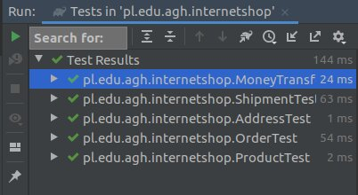
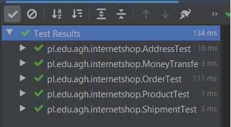
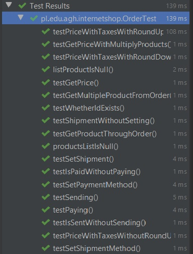
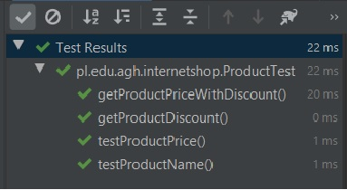

# Laboratorium 5
## Testy jednostkowe
## Autorzy: Andrii Trishch, Uladzislau Tumilovich


#### Krok 1. Zmiana wartości procentowej z _22_ na _23_:

**a)** Została zamieniona wartość oczekiwana testu _testPriceWithTexesWithoutRoundUp_ z _2.44_ na _2.46_


```java
public class OrderTest {
  
  ...
  
	@Test
	public void testPriceWithTaxesWithoutRoundUp() {
		// given

		// when
		Order order = getOrderWithCertainProductPrice(2); // 2 PLN

		// then
		assertBigDecimalCompareValue(order.getPriceWithTaxes(), BigDecimal.valueOf(2.46)); // 2.46 PLN
	}
  
  ...
}
```

**b)** W klasie **Order** zostało zmienione pole _TAX_VALUE_ z _BigDecimal.valueOf(1.22)_ na _BigDecimal.valueOf(1.23)_

```java
public class Order {
  private static final BigDecimal TAX_VALUE = BigDecimal.valueOf(1.23);
 
  ...
}
```

**c)** Po uruchomieniu wszystkich testów




#### Krok 2. Rozszerzenie funkcjalności systemu:

**a)** Została wprowadzona modyfikacja API klasy **Order** w taki spośob, żeby przechowywać i zwracać liste produktów

```java
public class Order {
    private static final BigDecimal TAX_VALUE = BigDecimal.valueOf(1.23);
	private final UUID id;
    // private final Product product;
    private boolean paid;
    private Shipment shipment;
    private ShipmentMethod shipmentMethod;
    private PaymentMethod paymentMethod;

    public Order(List<Product> product) {
        // this.product = product;
        id = UUID.randomUUID();
        paid = false;
    }

    public UUID getId() {
        return id;
    }

    public void setPaymentMethod(PaymentMethod paymentMethod) {
        this.paymentMethod = paymentMethod;
    }

    public PaymentMethod getPaymentMethod() {
        return paymentMethod;
    }

    public boolean isSent() {
        return shipment != null && shipment.isShipped();
    }

    public boolean isPaid() { return paid; }

    public Shipment getShipment() {
        return shipment;
    }

    public BigDecimal getPrice() {
        return null; //product.getPrice();
    }

    public BigDecimal getPriceWithTaxes() {
        return getPrice().multiply(TAX_VALUE).setScale(Product.PRICE_PRECISION, Product.ROUND_STRATEGY);
    }

    public List<Product> getProducts() {
        return null;
    }

    public ShipmentMethod getShipmentMethod() {
        return shipmentMethod;
    }

    public void setShipmentMethod(ShipmentMethod shipmentMethod) {
        this.shipmentMethod = shipmentMethod;
    }

    public void send() {
        boolean sentSuccesful = getShipmentMethod().send(shipment, shipment.getSenderAddress(), shipment.getRecipientAddress());
        shipment.setShipped(sentSuccesful);
    }

    public void pay(MoneyTransfer moneyTransfer) {
        moneyTransfer.setCommitted(getPaymentMethod().commit(moneyTransfer));
        paid = moneyTransfer.isCommitted();
    }

    public void setShipment(Shipment shipment) {
        this.shipment = shipment;
    }
}
```

**b)** Została zmodyfikowana klasa **OrderTest**, zmiany winikają z zmiany *product* z objektu **Product** do listy **List&lt;Product&gt;** 
```java
public class OrderTest {
...

    private Order getOrderWithMockedProduct() {
        Product product = mock(Product.class);
        return new Order(Collections.singletonList(product));
    }

    @Test
    public void testGetProductThroughOrder() {
        // given
        Product expectedProduct = mock(Product.class);
        Order order = new Order(Collections.singletonList(expectedProduct));

        // when
        List<Product> actualProducts = order.getProducts();

        // then
        assertSame(expectedProduct, actualProducts.get(0));
    }

    @Test
    public void testGetPrice() throws Exception {
        // given
        BigDecimal expectedProductPrice = BigDecimal.valueOf(1000);
        Product product = mock(Product.class);
        given(product.getPrice()).willReturn(expectedProductPrice);
        Order order = new Order(Collections.singletonList(product));

        // when
        BigDecimal actualProductPrice = order.getPrice();

        // then
        assertBigDecimalCompareValue(expectedProductPrice, actualProductPrice);
    }

    @Test
    private Order getOrderWithCertainProductPrice(double productPriceValue) {
        BigDecimal productPrice = BigDecimal.valueOf(productPriceValue);
        Product product = mock(Product.class);
        given(product.getPrice()).willReturn(productPrice);
        return new Order(Collections.singletonList(product));
    }
	...
}
```

**c)** Następnie została zmodyfikowana klasa **Order** w taki spośob, żeby przechodziły już wcześniej poprawione testy

```java
public class Order {
    private static final BigDecimal TAX_VALUE = BigDecimal.valueOf(1.23);
    private final UUID id;
    private final List<Product> products;
    private boolean paid;
    private Shipment shipment;
    private ShipmentMethod shipmentMethod;
    private PaymentMethod paymentMethod;

    public Order(List<Product> products) {
        this.products = products;
        id = UUID.randomUUID();
        paid = false;
    }

    public UUID getId() {
        return id;
    }

    public void setPaymentMethod(PaymentMethod paymentMethod) {
        this.paymentMethod = paymentMethod;
    }

    public PaymentMethod getPaymentMethod() {
        return paymentMethod;
    }

    public boolean isSent() {
        return shipment != null && shipment.isShipped();
    }

    public boolean isPaid() { return paid; }

    public Shipment getShipment() {
        return shipment;
    }

    public BigDecimal getPrice() {
        BigDecimal price = BigDecimal.valueOf(0.0);
        for (Product product: products) {
            price = price.add(product.getPrice());
        }
        return price;
    }

    public BigDecimal getPriceWithTaxes() {
        return getPrice().multiply(TAX_VALUE).setScale(Product.PRICE_PRECISION, Product.ROUND_STRATEGY);
    }

    public List<Product> getProducts() {
        return products;
    }

    public ShipmentMethod getShipmentMethod() {
        return shipmentMethod;
    }

    public void setShipmentMethod(ShipmentMethod shipmentMethod) {
        this.shipmentMethod = shipmentMethod;
    }

    public void send() {
        boolean sentSuccesful = getShipmentMethod().send(shipment, shipment.getSenderAddress(),shipment.getRecipientAddress());
        shipment.setShipped(sentSuccesful);
    }

    public void pay(MoneyTransfer moneyTransfer) {
        moneyTransfer.setCommitted(getPaymentMethod().commit(moneyTransfer));
        paid = moneyTransfer.isCommitted();
    }

    public void setShipment(Shipment shipment) {
        this.shipment = shipment;
    }
}
```

**d)** Po uruchomieniu wszystkich testów



**e)** Dodano poszczególne testy do **OrderTest**:  
* **getMultipleProdutFromOrder** -sprawdza czy rzeczywiście przekazane **List&lt;Product&gt;** określoną dlugość
```java
 @Test
public void testGetMultipleProductFromOrder() {
	// given
	Product expectedProduct = mock(Product.class);
	Product expectedProduct1 = mock(Product.class);

	// when
	Order order=new Order(Arrays.asList(expectedProduct,expectedProduct1));

	// then
	assertSame(expectedProduct,order.getProducts().get(0));
	assertSame(expectedProduct1,order.getProducts().get(1));
	assertEquals(2,order.getProducts().size());
}
```
* **productsListIsNull** -sprawdza czy przy tworzeniu **Order** wrzuca wyjątek, jeżeli przekazana lista mieści product jaki jest **NULL**-em
```java
@Test
public void listProductIsNull() {
	// given
	List<Product> products = Arrays.asList(mock(Product.class), null);

	// when then
	assertThrows(NullPointerException.class, () -> new Order(products));
}
```
* **listProductIsNull**- sprawdza czy przy tworzeniu **Order** wrzuca wyjątek, jeżeli przekazana lista jest **NULL**-em
```java
@Test
public void productsListIsNull() {
	// when then
	assertThrows(NullPointerException.class, () -> new Order(null));
}
```

**f)** Został zmieniony konstructor klasy **Order** dla sprawdzania poszczególnych warunków
```java
public Order(List<Product> products) {
	products.forEach((p)->Objects.requireNonNull(p,"product cannot be null"));
	this.products = Objects.requireNonNull(products, "products list cannot be null");
	id = UUID.randomUUID();
	paid = false;
}
```

**g)** Po uruchomieniu wszystkich testów **OrderTest**



#### Krok 3. Dodanie możliwości dodawania rabatu do produktu i całego zamówienia:

**a)** Został dodany atrybut _discount_ do klasy **Product** odpowiednie _Gettery_ i _Settery_ oraz funkcja _getPriceDiscount()_
```java 
public class Product {

    public static final int PRICE_PRECISION = 2;
    public static final int ROUND_STRATEGY = BigDecimal.ROUND_HALF_UP;

    private final String name;
    private final BigDecimal price;
    private final BigDecimal discount;

    public Product(String name, BigDecimal price, BigDecimal discount) {
        this.name = name;
        this.price = price;
        this.discount = discount;
        this.price.setScale(PRICE_PRECISION, ROUND_STRATEGY);
    }

    public String getName() {
        return name;
    }

    public BigDecimal getPrice() {
        return price;
    }

    public BigDecimal getDiscount() { return discount; }

    public BigDecimal getPriceWithDiscount() {
        return getPrice().subtract(getPrice().multiply(discount).setScale(PRICE_PRECISION, ROUND_STRATEGY));
    }
}
```

**b)** Zostały dopasowane testy do wprowadzonych powyżej zmian.  
Dodane testy:
* _getProductDiscount_- sprawdza poprawność przypisania zniżki.
* _getProductWithDiscount()_- sprawdza poprawność wyliczonej ceny z rabatem.
```java
public class ProductTest {

    private static final String NAME = "Mr. Sparkle";
    private static final BigDecimal PRICE = BigDecimal.valueOf(1);
    private static final BigDecimal DISCOUNT = BigDecimal.valueOf(0);

    @Test
    public void testProductName() throws Exception {
        // given

        // when
        Product product = new Product(NAME, PRICE, DISCOUNT);

        // then
        assertEquals(NAME, product.getName());
    }

    @Test
    public void testProductPrice() throws Exception {
        // given

        // when
        Product product = new Product(NAME, PRICE, PRICE);

        // then
        assertBigDecimalCompareValue(product.getPrice(), PRICE);
    }

    @Test
    public void getProductDiscount() throws Exception {
        // given
        BigDecimal discount = BigDecimal.valueOf(0.05);

        // when
        Product product = new Product(NAME, PRICE, discount);

        // then
        assertBigDecimalCompareValue(product.getDiscount(), discount);
    }

    @Test
    public void getProductPriceWithDiscount() throws Exception {
        // given

        // when
        Product product = new Product(NAME, PRICE, BigDecimal.valueOf(0.1));

        // then
        assertBigDecimalCompareValue(product.getPriceWithDiscount(), BigDecimal.valueOf(0.9));
    }
}
```

**c)** Po uruchomieniu wszystkich testów **ProductTest**  



**d)**  
1. Został dodany atrybut _discount_ do klasy **Order** odpowiednie _Gettery_ i _Settery_ oraz funkcji  
* _getPriceWithDiscount()_- oblicza wartość zamówienia z zniżką  
* _getPriceWithProductDiscount()_- oblicza wartość zamówienia z zniżką na poszczególne produkty  
2. Zmieniono funkcje
* _getPriceWithTaxes()_- oblicza wartość zamównie z zniżką i podatkiem. 

```java
public class Order {
    private static final BigDecimal TAX_VALUE = BigDecimal.valueOf(1.23);
    private final UUID id;
    private final List<Product> products;
    private boolean paid;
    private Shipment shipment;
    private ShipmentMethod shipmentMethod;
    private PaymentMethod paymentMethod;
    private final BigDecimal discount;

    public Order(List<Product> products, BigDecimal discount) {
        this.products = Objects.requireNonNull(products, "product cannot be null");
        this.products.forEach((p)->Objects.requireNonNull(p,"product cannot be null"));
        id = UUID.randomUUID();
        paid = false;
        this.discount = discount;
    }

    public BigDecimal getPrice() {
        BigDecimal price = BigDecimal.valueOf(0.0);
        for (Product product: products) {
            price = price.add(product.getPrice());
        }
        return price;
    }

    public BigDecimal getPriceWithProductDiscount(){
        BigDecimal price = BigDecimal.valueOf(0.0);
        for (Product product: products) {
            price = price.add(product.getPriceWithDiscount());
        }
        return price;
    }


    public BigDecimal getDiscount() {
        return discount;
    }

    public BigDecimal getPriceWithDiscount() {
        return getPriceWithProductDiscount().subtract(getPriceWithProductDiscount().multiply(discount)).setScale(Product.PRICE_PRECISION, Product.ROUND_STRATEGY);
    }

    public BigDecimal getPriceWithTaxes() {
        return getPriceWithDiscount().multiply(TAX_VALUE).setScale(Product.PRICE_PRECISION, Product.ROUND_STRATEGY);
    }

    ...
}
```

**e)** Zostały dopasowane testy do wprowadzonych powyżej zmian, został zmieniony sposób tworzenia **Order** przez wzmiany wprowadzone w kontruktorze.  

1. **Dodanę mocki:** 

* **getOrderWithCertainProductPrice** - zwraca order z produktem o zadanej wartości  
```java
private Order getOrderWithCertainProductPrice(double productPriceValue) {
	BigDecimal productPrice = BigDecimal.valueOf(productPriceValue);
	Product product = mock(Product.class);
	given(product.getPrice()).willReturn(productPrice);
	given(product.getPriceWithDiscount()).willReturn(productPrice);
	return new Order(Collections.singletonList(product),DISCOUNT);
}
```

* **getOrderWithCertainProductPriceDiscount** -zwraca order z produktem o zadanej wartości z zadaną zniżką
```java
private Order getOrderWithCertainProductPriceDiscount(double productPriceValue, double productDiscountValue) {
	BigDecimal productPrice = BigDecimal.valueOf(productPriceValue);
	BigDecimal productDiscount = BigDecimal.valueOf(productDiscountValue);
	Product product = mock(Product.class);
	given(product.getPrice()).willReturn(productPrice);
	given(product.getPriceWithDiscount()).willReturn(productPrice.subtract(productPrice.multiply(productDiscount)));
	return new Order(Collections.singletonList(product), DISCOUNT);
}
```

2. **Dodanę testy:**

* **getDiscount**- sprawdza poprawność przypisania rabatu
```java
@Test
public void getDiscount() {
	// given

	// when
	Order order = getOrderWithMockedProduct();

	// then
	assertBigDecimalCompareValue(DISCOUNT, order.getDiscount());
}
```

* **getPriceWithProductDiscount**- sprawdza poprawność obliczenia sumy poszczegółnych produktów z zniżką
```java
@Test
public void getPriceWithProductDiscount() {
	// given
	Product product = mock(Product.class);
	Product product1 = mock(Product.class);

	BigDecimal expectedOrderPrice = BigDecimal.valueOf(1.7);

	given(product.getPriceWithDiscount()).willReturn(BigDecimal.valueOf(0.9));
	given(product1.getPriceWithDiscount()).willReturn(BigDecimal.valueOf(0.8));

	// when
	Order order = new Order(Arrays.asList(product, product1), DISCOUNT);

	// then
	assertBigDecimalCompareValue(expectedOrderPrice, order.getPriceWithProductDiscount());
}
```

* **getPriceWithTaxes**- sprawdza poprawność obliczenia sumy zamówięnia z zniżką i podatkiem.
```java
@Test
public void getPriceWithTaxes() {
	double productPriceValue=1000;
	double productDiscountValue=0.10;
	Order order=getOrderWithCertainProductPriceDiscount(productPriceValue,productDiscountValue);
	BigDecimal expectedFinalPrice=BigDecimal.valueOf(productPriceValue).subtract(BigDecimal.valueOf(productPriceValue*productDiscountValue)).multiply(BigDecimal.valueOf(1.23));
	System.out.println(order.getPriceWithDiscount());
	assertBigDecimalCompareValue(order.getPriceWithTaxes(),expectedFinalPrice);
}
```

* **getPriceWithMultiplyProducts**- sprawdza czy zwrucona suma dla dwóch produktów jest poprawna.
```java 
@Test
public void getPriceWithMultiplyProducts(){
	// given
	Product product = mock(Product.class);
	Product product1 = mock(Product.class);

	BigDecimal expectedProductPrice = BigDecimal.valueOf(1500);

	given(product.getPrice()).willReturn(BigDecimal.valueOf(1000));
	given(product1.getPrice()).willReturn(BigDecimal.valueOf(500));

	// when
	Order order = new Order(Arrays.asList(product, product1), DISCOUNT);

	//then
	assertBigDecimalCompareValue(expectedProductPrice, order.getPrice());
}
```
**f)** Po uruchomieniu wszystkich testów **OrderTest**  


#### Krok 4. Dodanie historii zamówień:  

**a)** Został stworzony interfejs SearchStrategy
```java
public interface SearchStrategy {
    boolean filter(Order order);
}
```
**b)** Następnie została stworzona klasa **ProductNameSearchStrategy**, która implementuje interfejs **SearchStrategy**
```java
public class ProductNameSearchStrategy implements SearchStrategy {

    String name;

    public ProductNameSearchStrategy(String name) {
        this.name = name;
    }

    @Override
    public boolean filter(Order order) {
        List<Product> products = order.getProducts();
        for (Product p : products) if (p.getName() == this.name) return true;
        return false;
    }
}
```

**c)** Analogicznie do klasy **ProductNameSearchStrategy** została stworzona klasa **TotalPriceSearchStrategy**. 
```java
public class TotalPriceSearchStrategy implements SearchStrategy {
    BigDecimal price;

    public TotalPriceSearchStrategy(BigDecimal price) {
        this.price = price;
    }

    @Override
    public boolean filter(Order order) {
        System.out.println(order.getPriceWithTaxes());
        return order.getPriceWithTaxes().compareTo(this.price) == 0;
    }
}
```

**d)** i klasa **PayersSurnameSearchStrategy**
```java
public class PayersSurnameSearchStrategy implements SearchStrategy {
    String payersSurname;

    public PayersSurnameSearchStrategy(String payersSurname) {
        this.payersSurname = payersSurname;
    }

    @Override
    public boolean filter(Order order) {
        return order.getOrdersPayerSurname()==this.payersSurname;
    }
}
```

**e)** Została stworzona klasa  **CompositeSearchStrategy** która pozwalia na filtrowanie zamowień po więcej niż jedenym parametru.  
```java
public class CompositeSearchStrategy implements SearchStrategy {
    private final List<SearchStrategy> filters;

    public CompositeSearchStrategy(List<SearchStrategy> filters) {
        this.filters = filters;
    }

    @Override
    public boolean filter(Order order) {
        return filters.stream().allMatch(f->f.filter(order));
    }
}
```

**d)** Zostala stworzona klasa **OrdersHistory** dla przechowywania wszystkich zrobionych zamówień.
```java 
public class OrdersHistory {


    private List<Order> pastOrders;

    public OrdersHistory(List<Order> pastOrders) {
        this.pastOrders = pastOrders;
    }
    public void addOrder(Order o){
        this.pastOrders.add(o);
    }

    public List<Order> getPastOrders() {
        return pastOrders;
    }

    public void setPastOrders(List<Order> pastOrders) {
        this.pastOrders = pastOrders;
    }

    public List<Order> getFilteredOrders(SearchStrategy searchStrategy){
        List<Order> resultList=new ArrayList<>();
        for(Order o:pastOrders) if(searchStrategy.filter(o)) resultList.add(o);
        return resultList;
    }
}
```

**e)** ГРУПОВОЙ ТЕСТ ВЛАДОСЯН С ТЕБЯ ПОЩЕГУЛЬНЕ ТЕСТЫ
```java
class OrdersHistoryTest {
    private static final BigDecimal DISCOUNT = BigDecimal.valueOf(0);
    @Test
    void getFilteredOrders() {
        //given
        Product p=new Product("Apple", BigDecimal.valueOf(250),DISCOUNT);
        Product p1=new Product("Egg", BigDecimal.valueOf(200),DISCOUNT);
        Product p2=new Product("Milk", BigDecimal.valueOf(350),DISCOUNT);
        Product p3=new Product("Water", BigDecimal.valueOf(200),DISCOUNT);

        Order order=new Order(Arrays.asList(p,p1,p2,p3),DISCOUNT,"Trishch");
        Order order1=new Order(Arrays.asList(p,p2),DISCOUNT,"Tumilovich");
        Order order2=new Order(Arrays.asList(p3,p1),DISCOUNT,"Trishch");

        SearchStrategy s=new ProductNameSearchStrategy("Apple");
        SearchStrategy s1=new PayersSurnameSearchStrategy("Trishch");
        SearchStrategy s2=new TotalPriceSearchStrategy(BigDecimal.valueOf(738));

        CompositeSearchStrategy cs=new CompositeSearchStrategy(Arrays.asList(s,s1));
        OrdersHistory oh=new OrdersHistory(Arrays.asList(order,order1,order2));
        //when
        assertEquals(oh.getFilteredOrders(cs).size(),1);
        assertEquals(oh.getFilteredOrders(s).size(),2);
        assertEquals(oh.getFilteredOrders(s2).size(),1);

    }
}
```
